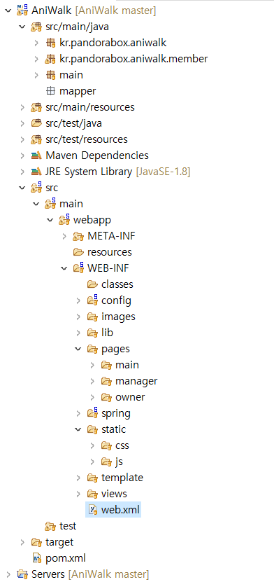
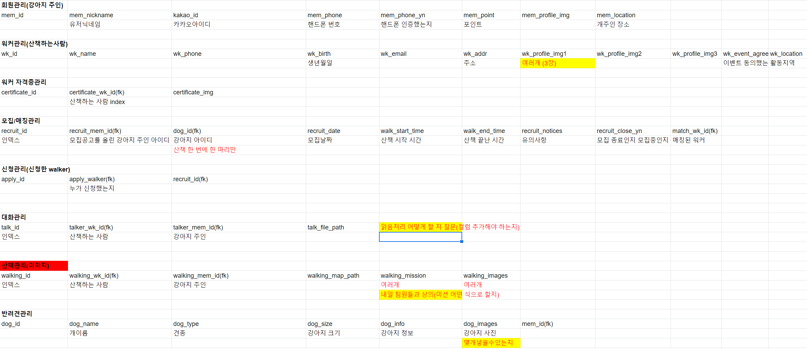

## 9/23(수) - 개발 시작 

### 환경설정 및 DB 

-----

#### 1. 환경설정 

- Language  
  - Java (JDK 1.8.0_241)
  -  jsp, jstl, el, html, css, javascript
- Program
  - IDE : STS 3
  - DataBase : Oracle(v XE112)
  - Server : Tomcat(v 9.0.35)
  - Framework : Spring, mybatis
  - 형상관리 도구: Git(소스트리)
  - Build Tool : Maven


-----------------

#### 2. 프로젝트 기본 세팅

> library 추가

###### < pom.xml >

```xml
<!-- jdbc -->
<dependency>
    <groupId>org.springframework</groupId>
    <artifactId>spring-jdbc</artifactId>
    <version>4.2.4.RELEASE</version>
</dependency>

<!-- tiles 설정 -->
<!-- https://mvnrepository.com/artifact/org.apache.tiles/tiles-servlet -->
<dependency>
    <groupId>org.apache.tiles</groupId>
    <artifactId>tiles-servlet</artifactId>
    <version>3.0.8</version>
</dependency>
<!-- https://mvnrepository.com/artifact/org.apache.tiles/tiles-jsp -->
<dependency>
    <groupId>org.apache.tiles</groupId>
    <artifactId>tiles-jsp</artifactId>
    <version>3.0.8</version>
</dependency>

<!-- mybatis -->
<!-- https://mvnrepository.com/artifact/org.mybatis/mybatis -->
<dependency>
    <groupId>org.mybatis</groupId>
    <artifactId>mybatis</artifactId>
    <version>3.2.8</version>
</dependency>

<!-- mybatis 와 spring 을 연결 시켜주는 라이브러리 -->
<!-- https://mvnrepository.com/artifact/org.mybatis/mybatis-spring -->
<dependency>
    <groupId>org.mybatis</groupId>
    <artifactId>mybatis-spring</artifactId>
    <version>1.2.2</version>
</dependency>

<!-- 파일 업로드 -->
<dependency>
    <groupId>commons-fileupload</groupId>
    <artifactId>commons-fileupload</artifactId>
    <version>1.2</version>
</dependency>
<dependency>
    <groupId>commons-io</groupId>
    <artifactId>commons-io</artifactId>
    <version>1.4</version>
</dependency>

<!-- json변환기 -->
<dependency>
    <groupId>com.fasterxml.jackson.core</groupId>
    <artifactId>jackson-core</artifactId>
    <version>2.4.6</version>
</dependency>
<dependency>
    <groupId>com.fasterxml.jackson.core</groupId>
    <artifactId>jackson-databind</artifactId>
    <version>2.4.6</version>
</dependency>

<!-- AOP기능 -->
<dependency>
    <groupId>org.springframework</groupId>
    <artifactId>spring-aop</artifactId>
    <version>4.2.4.RELEASE</version>
</dependency>
<dependency>
    <groupId>org.springframework</groupId>
    <artifactId>spring-aspects</artifactId>
    <version>4.2.4.RELEASE</version>
</dependency> 
```


> servlet

###### < web.xml >

```xml
<!-- Processes application requests -->
<servlet>
    <servlet-name>appServlet</servlet-name>
    <servlet-class>org.springframework.web.servlet.DispatcherServlet</servlet-class>
    <init-param>
        <param-name>contextConfigLocation</param-name>
        <param-value>
            /WEB-INF/config/spring-config.xml
            /WEB-INF/config/view-config.xml
        </param-value>
    </init-param>
    <load-on-startup>1</load-on-startup>
</servlet>

<servlet-mapping>
    <servlet-name>appServlet</servlet-name>
    <url-pattern>/</url-pattern>
</servlet-mapping>

<filter>
    <filter-name>encodingFilter</filter-name>
    <filter-class>org.springframework.web.filter.CharacterEncodingFilter</filter-class>
    <init-param>
        <param-name>encoding</param-name>
        <param-value>UTF-8</param-value>
    </init-param>
</filter>
<filter-mapping>
    <filter-name>encodingFilter</filter-name>
    <url-pattern>/*</url-pattern>
</filter-mapping>
```


> spring

###### < spring-config >

```xml
<!-- Enables the Spring MVC @Controller programming model -->
<annotation-driven />

<!-- Handles HTTP GET requests for /resources/** by efficiently serving 
  up static resources in the ${webappRoot}/resources directory -->
<resources mapping="/images/**" location="/WEB-INF/images/" />
<resources mapping="/static/**" location="/WEB-INF/static/" />


<!-- Resolves views selected for rendering by @Controllers to .jsp resources 
  in the /WEB-INF/views directory -->
<!-- ==============뷰리졸버에 대한 등록================================= -->
<beans:bean
            class="org.springframework.web.servlet.view.InternalResourceViewResolver">
    <beans:property name="prefix" value="/WEB-INF/" />
    <beans:property name="suffix" value=".jsp" />
    <beans:property name="order" value="2" />
</beans:bean>

<!-- =====================db관련 작업============================== -->
<beans:bean id="ds"
            class="org.springframework.jndi.JndiObjectFactoryBean">
    <beans:property name="jndiName" value="jdbc/myspring" />
    <beans:property name="resourceRef" value="true" />
</beans:bean>

<!-- ======================어노테이션============================== -->
<context:component-scan base-package="kr.pandorabox.aniwalk" />
<context:component-scan base-package="main" />

<!-- ======================tiles를 사용하기 위한 설정=================== -->
<!-- 1. tiles설정파일 등록하기 -->
<beans:bean id="tilesConfigurer"
            class="org.springframework.web.servlet.view.tiles3.TilesConfigurer">
    <beans:property name="definitions">
        <beans:list>
            <beans:value>/WEB-INF/**/*-tiles.xml</beans:value>
        </beans:list>
    </beans:property>
</beans:bean>

<!-- 2. ViewResolver가 기본 jsp로 뷰를 생성하지 않고 tiles프레임워크를 통해서 뷰를 만들도록 뷰리졸버 등록하기 -->
<beans:bean id="tilesViewResolver"
            class="org.springframework.web.servlet.view.UrlBasedViewResolver">
    <beans:property name="viewClass"
                    value="org.springframework.web.servlet.view.tiles3.TilesView" />
    <beans:property name="order" value="1" />
</beans:bean>

<!-- ====================== mybatis를 사용하기 위한 설정 =================== -->
<!-- mybatis와 spring을 연동하기 위해 필요한 객체 -->
<beans:bean id="sqlSessionFactory"
            class="org.mybatis.spring.SqlSessionFactoryBean">
    <beans:property name="dataSource" ref="ds" />
    <beans:property name="configLocation"
                    value="/WEB-INF/config/mybatis-config.xml" />
</beans:bean>
<!-- mybatis의 핵심클래스를 등록(spring jdbc의 JdbcTemplate과 동일한 작업) DB테이블을 CLRUD할 
  수 있는 기능을 제공 -->
<beans:bean id="sqlSession"
            class="org.mybatis.spring.SqlSessionTemplate">
    <beans:constructor-arg ref="sqlSessionFactory" />
</beans:bean>

<!-- ====================== 파일업로드 =================== -->
<beans:bean id="multipartResolver"
            class="org.springframework.web.multipart.commons.CommonsMultipartResolver">
    <beans:property name="maxUploadSize" value="4000000"/>	
</beans:bean>

<!-- =========aop를 이용한 선언적 트랜잭션의 처리============== -->
<!-- 1. 트랜잭션 처리를 위해 제공하는 spring클래스를 등록 -->
<beans:bean id="transactionManager"
            class="org.springframework.jdbc.datasource.DataSourceTransactionManager">
    <beans:property name="dataSource" ref="ds"/>
</beans:bean>
<!-- 2. 1번에서 등록한 트랜잭션 처리 클래스를 advice로 등록 -->
<tx:advice id="transactionAdvice"
           transaction-manager="transactionManager">
    <tx:attributes>
        <tx:method name="insert" rollback-for="Exception"/>
    </tx:attributes>
</tx:advice>
<!-- 3. aop처리 -->
<aop:config>

</aop:config>
```


-------------------

##### <View 연결>

> tiles

###### < main-tiles >

```xml
<tiles-definitions>
	<!-- 메인 템플릿 등록 -->
	<definition name="mainTemplate" 
			template="/WEB-INF/template/indexTemplate.jsp">
		<put-attribute name="nav" value="/WEB-INF/pages/main/nav.jsp"/>
		<put-attribute name="sign" value="/WEB-INF/pages/main/signUp.jsp"/>
		<put-attribute name="content" value="/WEB-INF/pages/main/content.jsp"/>
	</definition>
	
	<!-- owner템플릿 등록 -->
	<definition name="ownerTemplate" 
			template="/WEB-INF/template/ownerTemplate.jsp">
		<put-attribute name="content" value="/WEB-INF/pages/owner/ownerIndex.jsp"/>
		<put-attribute name="nav" value="/WEB-INF/pages/owner/ownerNav.jsp"/>
	</definition>
	
	<!-- 관리자 템플릿 등록 -->
	<definition name="managerTemplate" 
			template="/WEB-INF/template/managerTemplate.jsp">
		<put-attribute name="content" value="/WEB-INF/pages/manager/managerIndex.jsp"/>
		<put-attribute name="nav" value="/WEB-INF/pages/manager/managerNav.jsp"/>
		<put-attribute name="top" value="/WEB-INF/pages/manager/managerTop.jsp"/>
	</definition>
	
	<!-- index 페이지 등록 -->
	<definition name="index" extends="mainTemplate"></definition>
	<definition name="owner/index" extends="ownerTemplate"></definition>
	<definition name="manager/index" extends="managerTemplate"></definition>
</tiles-definitions>
```





-----------


#### 3. DB설계

- 테이블 설계 : 외래키와 기본키 설정
- (미완성) 하나의 컬럼에 여러 로우가 필요하면 어떻게 처리할지




