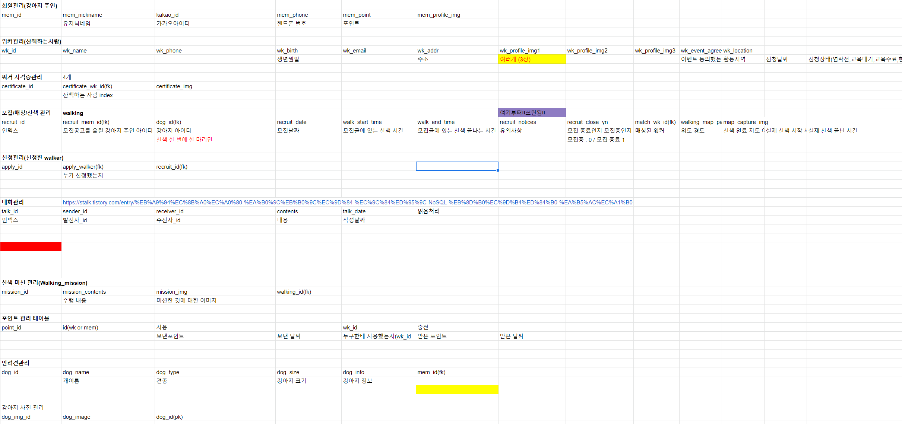
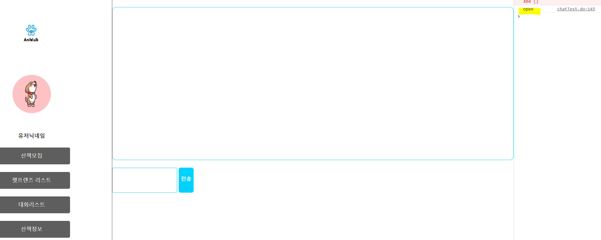
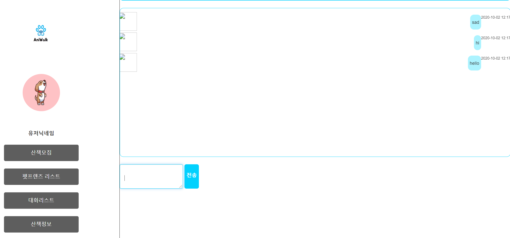

## 9/24(목) 개발 시작 

### DB 

-----

#### 1. DB설계

- DB수정
  - (추가) 포인트 관리 테이블 추가
  - (수정) 산책 미션관리 테이블 추가 : walking_img가 다수의 컬럼 필요로 하나의 테이블 생성
  - (추가) 산책관리 테이블에서 map_capture_img 추가
  - (수정) 강아지 사진 관리 테이블 추가 : dog_img가 여러 컬럼이 필요




------------

### 웹소켓 Test

-----------

#### 2. 1:1 채팅 기능 구현을 위한 test

- 진행 중인 프로젝트를 다른 workspace에 복사하여 웹소켓 연결을 테스트


###### <pom.xml> : 라이브러리 추가

```xml
<!-- https://mvnrepository.com/artifact/org.springframework/spring-websocket -->
<dependency>
    <groupId>org.springframework</groupId>
    <artifactId>spring-websocket</artifactId>
    <version>4.2.4.RELEASE</version>
</dependency>

<!-- jackson-databind -->
<dependency>
  <groupId>com.fasterxml.jackson.core</groupId>
  <artifactId>jackson-databind</artifactId>
  <version>2.8.4</version>
</dependency>
```


###### <ws-config.xml> 생성 : 웹소켓 관련 xml

```xml
<?xml version="1.0" encoding="UTF-8"?>
<beans xmlns="http://www.springframework.org/schema/beans"
 xmlns:xsi="http://www.w3.org/2001/XMLSchema-instance"
 xmlns:websocket="http://www.springframework.org/schema/websocket"
 xmlns:mvc="http://www.springframework.org/schema/mvc"
 xsi:schemaLocation="http://www.springframework.org/schema/websocket http://www.springframework.org/schema/websocket/spring-websocket-4.0.xsd http://www.springframework.org/schema/mvc http://www.springframework.org/schema/mvc/spring-mvc-4.0.xsd http://www.springframework.org/schema/beans http://www.springframework.org/schema/beans/spring-beans.xsd">
 <bean id="chatHandler" class="kr.pandorabox.aniwalk.member.ChatWebSocketHandler" />

 <websocket:handlers>


  <websocket:mapping handler="chatHandler" path="/chat" />
	  <websocket:handshake-interceptors>
         <bean class="org.springframework.web.socket.server.support.HttpSessionHandshakeInterceptor" />
      </websocket:handshake-interceptors>
  <websocket:sockjs />

 </websocket:handlers>

 <mvc:default-servlet-handler />
</beans>
```


###### <viewChat.jsp>

```jsp
<%@ page language="java" contentType="text/html; charset=UTF-8"
	pageEncoding="UTF-8"%>
<%@ taglib uri="http://java.sun.com/jsp/jstl/core" prefix="c"%>
<%@ taglib prefix="fn" uri="http://java.sun.com/jsp/jstl/functions"%>
<%@ taglib prefix="fmt" uri="http://java.sun.com/jsp/jstl/fmt"%>
<%@ taglib prefix="c" uri="http://java.sun.com/jsp/jstl/core"%>


<html>
<head>
<script type="text/javascript"
	src="https://cdnjs.cloudflare.com/ajax/libs/sockjs-client/1.1.5/sockjs.min.js"></script>
<script src="http://cdnjs.cloudflare.com/ajax/libs/jquery/3.2.1/jquery.js"></script>

<style>
</style>
</head>

<body>

<c:set var="profile" value='<%=session.getAttribute("login")%>' />


 	<div class="col-12 row justify-content-center align-items-center my-5 ">
		
	</div>
	<div class="col-12">
		<div class="col-2" style="float: left">
			<span> 목록 </span>
		</div>
		<div class="col-8" style="float: left; text-align: center;">
			${tutor_name } 님과 대화</div>
		<div class="col-2" style="float: right">
			<span> 닫기 </span>
		</div>


	</div>
	<div class="col-12" style="margin-top: 40px; clear: both;">
		<div class="col-10"
			style="margin: 20px auto; text-align: center; color: white; background-color: #01D1FE; border: 1px solid #01D1FE; padding: 10px 10px; border-radius: 8px;">
			수업 일정과 강의 내용에 대해 문의해보세요. <br>(연락처 문의 또는 직접 알려주는 것은 불가)
		</div>

	</div>
	<!-- 채팅 내용 -->
	<div class="col-12">
		<div class="col-11"
			style="margin: 0 auto; border: 1px solid #01D1FE; height: 400px; border-radius: 10px; overflow:scroll" id = "chatArea">

			<div id="chatMessageArea" style = "margin-top : 10px; margin-left:10px;"></div>


		</div>
	</div>

	<!-- 채팅 입력창 -->
	<div class="col-12" style="margin-top: 20px; margin-bottom: 15px;">
		<div class="col-12" style="float: left">
			<textarea class="form-control"
				style="border: 1px solid #01D1FE; height: 65px; float: left; width: 80%"
				placeholder="Enter ..." id = "message">


				</textarea>
			<span
				style="float: right; width: 18%; height: 65px; text-align: center; background-color: #01D1FE; border-radius: 5px;">
				<a
				style="margin-top: 30px; text-align: center; color: white; font-weight: bold;" id = "sendBtn"><br>전송</a>
			</span>
		</div>

	</div>

<input type="text" id="nickname" value = "user" style = "display:none">
<input type="button" id="enterBtn" value="입장" style = "display:none">
<input type="button" id="exitBtn" value="나가기" style = "display:none">
 
<script type="text/javascript">
 connect();

 function connect() {
	    sock = new SockJS('http://localhost:8080/aniwalk/chat/');
	    sock.onopen = function() {
	        console.log('open');
	    };
	    sock.onmessage = function(evt) {
    	 var data = evt.data;
    	   console.log(data)
  		   var obj = JSON.parse(data)  	   
    	   console.log(obj)
    	   appendMessage(obj.message_content);
	    };
	    sock.onclose = function() {
	    	 appendMessage("연결을 끊었습니다.");
	        console.log('close');
	    };
	}

 function send() {
  var msg = $("#message").val();
  if(msg != ""){
	  message = {};
	  message.message_content = $("#message").val()
  	  message.message_sender = 'sejin_sender'
  	  message.message_receiver = 'sejin_receiver'
  	  //message.CLASS_class_id = '1'
  	  //message.message_sender = 'user'
		if(msg == ''){
			 return false;
		 }else{


		 var t = getTimeStamp();
		 $("#chatMessageArea").append("<div class='col-12 row' style = 'height : auto; margin-top : 5px;'><div class='col-2' style = 'float:left; padding-right:0px; padding-left : 0px;'><div style='font-size:9px; clear:both;'>${user_name}</div></div><div class = 'col-10' style = 'overflow : y ; margin-top : 7px; float:right;'><div class = 'col-12' style = ' background-color:#ACF3FF; padding : 10px 5px; float:left; border-radius:10px;'><span style = 'font-size : 12px;'>"+msg+"</span></div><div col-12 style = 'font-size:9px; text-align:right; float:right;'><span style ='float:right; font-size:9px; text-align:right;' >"+t+"</span></div></div></div>")		 

		  var chatAreaHeight = $("#chatArea").height();
		  var maxScroll = $("#chatMessageArea").height() - chatAreaHeight;
		  $("#chatArea").scrollTop(maxScroll);

		 }
  }

  sock.send(JSON.stringify(message));
  $("#message").val("");
 }


 function getTimeStamp() {
   var d = new Date();
   var s =
     leadingZeros(d.getFullYear(), 4) + '-' +
     leadingZeros(d.getMonth() + 1, 2) + '-' +
     leadingZeros(d.getDate(), 2) + ' ' +

     leadingZeros(d.getHours(), 2) + ':' +
     leadingZeros(d.getMinutes(), 2) + ':' +
     leadingZeros(d.getSeconds(), 2);

   return s;
 }

 function leadingZeros(n, digits) {
   var zero = '';
   n = n.toString();

   if (n.length < digits) {
     for (i = 0; i < digits - n.length; i++)
       zero += '0';
   }
   return zero + n;
 }

 function appendMessage(msg) {
	console.log("appendMessage");
	console.log("msg"+msg)
	 if(msg == ''){
		 return false;
	 }else{


	 var t = getTimeStamp();
	 $("#chatMessageArea").append("<div class='col-12 row' style = 'height : auto; margin-top : 5px;'><div class='col-2' style = 'float:left; padding-right:0px; padding-left : 0px;'><div style='font-size:9px; clear:both;'>${user_name}</div></div><div class = 'col-10' style = 'overflow : y ; margin-top : 7px; float:right;'><div class = 'col-12' style = ' background-color:#ACF3FF; padding : 10px 5px; float:left; border-radius:10px;'><span style = 'font-size : 12px;'>"+msg+"</span></div><div col-12 style = 'font-size:9px; text-align:right; float:right;'><span style ='float:right; font-size:9px; text-align:right;' >"+t+"</span></div></div></div>")		 

	  var chatAreaHeight = $("#chatArea").height();
	  var maxScroll = $("#chatMessageArea").height() - chatAreaHeight;
	  $("#chatArea").scrollTop(maxScroll);

	 }
 }
 $(document).ready(function() {
  $('#message').keypress(function(event){
   var keycode = (event.keyCode ? event.keyCode : event.which);
   if(keycode == '13'){
    send();
   }
   event.stopPropagation();
  });

  $('#sendBtn').click(function() { send(); });/* $('#enterBtn').click(function() { connect(); }); $('#exitBtn').click(function() { disconnect(); }); */
 });
</script>

</body>
</html>

```


###### <ChatWebSocketHandler.java>

```java
package kr.pandorabox.aniwalk.member;

import java.util.ArrayList;
import java.util.Date;
import java.util.List;
import java.util.Map;

import java.util.concurrent.ConcurrentHashMap;

import javax.inject.Inject;

import org.springframework.stereotype.Controller;
import org.springframework.web.bind.annotation.RequestMapping;
import org.springframework.web.socket.CloseStatus;

import org.springframework.web.socket.TextMessage;

import org.springframework.web.socket.WebSocketSession;

import org.springframework.web.socket.handler.TextWebSocketHandler;

@RequestMapping("/chat")
public class ChatWebSocketHandler extends TextWebSocketHandler {

	private List<WebSocketSession> connectedUsers;

	public ChatWebSocketHandler() {
	      connectedUsers = new ArrayList<WebSocketSession>();
	      System.out.println("=====연결=======");
	      System.out.println(connectedUsers);
	   }
    
	private Map<String, WebSocketSession> users = new ConcurrentHashMap<String, WebSocketSession>();

	@Override

	public void afterConnectionEstablished(

			WebSocketSession session) throws Exception {
		System.out.println("=====연결2=======");
		log(session.getId() + " 연결 됨!!");

		users.put(session.getId(), session);
		connectedUsers.add(session);
	}

	@Override
	public void afterConnectionClosed(

			WebSocketSession session, CloseStatus status) throws Exception {

		log(session.getId() + " 연결 종료됨");
		connectedUsers.remove(session);
		users.remove(session.getId());

	}

	@Override
	   protected void handleTextMessage(WebSocketSession session, TextMessage message) throws Exception {

		System.out.println("=====연결3=======");
		System.out.println(message.getPayload());
//
//		  Map<String, Object> map = null;
//
//	      MessageVO messageVO = MessageVO.convertMessage(message.getPayload());
//
//	      System.out.println("1 : " + messageVO.toString());

//	      ChatRoomVO roomVO  = new ChatRoomVO();
//	      roomVO.setCLASS_class_id(messageVO.getCLASS_class_id()); //클래스
//	      roomVO.setTUTOR_USER_user_id(messageVO.getTUTOR_USER_user_id()); //튜터
//	      roomVO.setUSER_user_id(messageVO.getUSER_user_id()); //유저
//
//	      ChatRoomVO croom =null;
//	      if(!messageVO.getUSER_user_id().equals(messageVO.getTUTOR_USER_user_id())) {
//	    	  System.out.println("a");
//
//
//
//	    	  if(dao.isRoom(roomVO) == null ) {
//	    		  System.out.println("b");
//	    		  dao.createRoom(roomVO);
//	    		  System.out.println("d");
//	    		  croom = dao.isRoom(roomVO);
//
//	    	  }else {
//	    		  System.out.println("C");
//	    		  croom = dao.isRoom(roomVO);
//	    	  }
//	      }else {
//
//    		  croom = dao.isRoom(roomVO);
//    	  }
//
//	      messageVO.setCHATROOM_chatroom_id(croom.getChatroom_id());
//	      if(croom.getUSER_user_id().equals(messageVO.getMessage_sender())) {
//
//	    	  messageVO.setMessage_receiver(roomVO.getTUTOR_USER_user_id());
//	      }else {
//	    	  messageVO.setMessage_receiver(roomVO.getUSER_user_id());
//	      }
//	      for (WebSocketSession websocketSession : connectedUsers) {
//	         map = websocketSession.getAttributes();
//	         UserVO login = (UserVO) map.get("login");
//
//	         //받는사람
//	         if (login.getUser_id().equals(messageVO.getMessage_sender())) {
//
//	            Gson gson = new Gson();
//	            String msgJson = gson.toJson(messageVO);
//	            websocketSession.sendMessage(new TextMessage(msgJson));
//	         }
//
//	      }
		
	   }
	@Override

	public void handleTransportError(

			WebSocketSession session, Throwable exception) throws Exception {

		log(session.getId() + " 익셉션 발생: " + exception.getMessage());

	}

	private void log(String logmsg) {

		System.out.println(new Date() + " : " + logmsg);
	}
}
```


- 결과

  - 연결 성공

  

  

  - 메시지가 화면에 출력하는 것까지 완성

  


