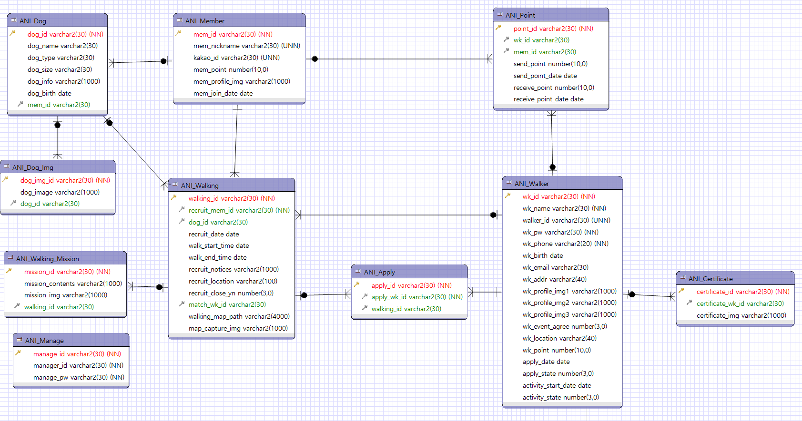

## 9/25(금)  

### DB 

-----

#### 1. DB설계

- DB data type 설정 완료



- DDL문 작성

```SQL

/* Drop Tables */

DROP TABLE ANI_Apply CASCADE CONSTRAINTS;
DROP TABLE ANI_Certificate CASCADE CONSTRAINTS;
DROP TABLE ANI_Dog_Img CASCADE CONSTRAINTS;
DROP TABLE ANI_Walking_Mission CASCADE CONSTRAINTS;
DROP TABLE ANI_Walking CASCADE CONSTRAINTS;
DROP TABLE ANI_Dog CASCADE CONSTRAINTS;
DROP TABLE ANI_Point CASCADE CONSTRAINTS;
DROP TABLE ANI_Member CASCADE CONSTRAINTS;
DROP TABLE ANI_Walker CASCADE CONSTRAINTS;
DROP TABLE ANI_Manage CASCADE CONSTRAINTS;

/*drop seq*/


DROP SEQUENCE seq_dog;
DROP SEQUENCE seq_dog_img ;
DROP SEQUENCE seq_walking_mission ;
DROP SEQUENCE seq_walking ;
DROP SEQUENCE seq_member ;
DROP SEQUENCE seq_apply ;
DROP SEQUENCE seq_point ;
DROP SEQUENCE seq_walker ;
DROP SEQUENCE seq_certificate ;
DROP SEQUENCE seq_manage ;

/*create seq*/
create SEQUENCE seq_dog start with 1 increment by 1;
create SEQUENCE seq_dog_img start with 1 increment by 1;
create SEQUENCE seq_walking_mission start with 1 increment by 1;
create SEQUENCE seq_walking start with 1 increment by 1;
create SEQUENCE seq_member start with 1 increment by 1;
create SEQUENCE seq_apply start with 1 increment by 1;
create SEQUENCE seq_point start with 1 increment by 1;
create SEQUENCE seq_walker start with 1 increment by 1;
create SEQUENCE seq_certificate start with 1 increment by 1;
create SEQUENCE seq_manage start with 1 increment by 1;

/* Create Tables */

CREATE TABLE ANI_Manage
(
   -- 인덱스
   manage_id varchar2(30) NOT NULL,
   -- 아이디
   manager_id varchar2(30) NOT NULL,
   manage_pw varchar2(30) NOT NULL,
   PRIMARY KEY (manage_id)
);

CREATE TABLE ANI_Apply
(
   apply_id varchar2(30) NOT NULL,
   -- 워커 인덱스
   apply_wk_id varchar2(30) NOT NULL,
   -- walking 테이블 index
   walking_id varchar2(30),
   PRIMARY KEY (apply_id)
);


CREATE TABLE ANI_Certificate
(
   certificate_id varchar2(30) NOT NULL,
   -- 워커 인덱스
   certificate_wk_id varchar2(30),
   certificate_img varchar2(1000),
   PRIMARY KEY (certificate_id)
);


CREATE TABLE ANI_Dog
(
   dog_id varchar2(30) NOT NULL,
   -- 개이름
   dog_name varchar2(30),
   -- 견종
   dog_type varchar2(30),
   dog_size varchar2(30),
   -- 개 정보
   dog_info varchar2(1000),
   dog_birth date,
   -- 인덱스
   mem_id varchar2(30),
   PRIMARY KEY (dog_id)
);


CREATE TABLE ANI_Dog_Img
(
   dog_img_id varchar2(30) NOT NULL,
   dog_image varchar2(1000),
   dog_id varchar2(30),
   PRIMARY KEY (dog_img_id)
);


CREATE TABLE ANI_Member
(
   -- 인덱스
   mem_id varchar2(30) NOT NULL,
   mem_nickname varchar2(30) NOT NULL UNIQUE,
   kakao_id varchar2(30) NOT NULL UNIQUE,
   -- 포인트
   mem_point number(10,0) DEFAULT 0,
   -- 프로필 사진 
   mem_profile_img varchar2(1000),
   mem_join_date date DEFAULT sysdate,
   PRIMARY KEY (mem_id)
);


CREATE TABLE ANI_Point
(
   point_id varchar2(30) NOT NULL,
   -- 워커 인덱스
   wk_id varchar2(30),
   -- 인덱스
   mem_id varchar2(30),
   -- 워커에게 포인트를 보냈거나 포인트를 현금으로 전환
   send_point number(10,0),
   send_point_date date,
   -- 워커가 포인트를 받았거나 유저가 포인트를 충전했거나
   receive_point number(10,0),
   receive_point_date date,
   PRIMARY KEY (point_id)
);


CREATE TABLE ANI_Walker
(
   -- 워커 인덱스
   wk_id varchar2(30) NOT NULL,
   wk_name varchar2(30) NOT NULL,
   -- 워커 아이디
   -- 
   walker_id varchar2(30) NOT NULL UNIQUE,
   -- 비밀번호
   wk_pw varchar2(30) NOT NULL,
   wk_phone varchar2(20) NOT NULL,
   wk_birth date,
   wk_email varchar2(30),
   wk_addr varchar2(40),
   wk_profile_img1 varchar2(1000),
   wk_profile_img2 varchar2(1000),
   wk_profile_img3 varchar2(1000),
   -- 이벤트 이메일 수집 동의했는지
   -- 동의: 1 비동의 :0
   wk_event_agree number(3,0),
   -- 활동지역
   wk_location varchar2(40),
   -- 워커 포인트
   wk_point number(10,0) DEFAULT 0,
   -- 워커 신청 날짜
   apply_date date,
   -- 신청 상태
   -- 1. 서류 검토 중
   -- 2. 교육 대기
   -- 3. 교육 수료
   -- 4. 합격
   -- 5. 불합격
   apply_state number(3,0) DEFAULT 1,
   -- 활동 시작 날짜(id 생성 날짜)
   activity_start_date date,
   -- 활동 중 : 1
   -- 활동 중지: 2 
   activity_state number(3,0),
   PRIMARY KEY (wk_id)
);


CREATE TABLE ANI_Walking
(
   walking_id varchar2(30) NOT NULL,
   -- 모집 공고를 올린 mem_id
   recruit_mem_id varchar2(30) NOT NULL,
   -- 개 인덱스 
   dog_id varchar2(30),
   -- 모집 등록한 날짜
   recruit_date date DEFAULT sysdate,
   -- 모집글에 있는 산책 시작 시간
   walk_start_time date,
   -- 모집글에 있는 산책 끝나는 시간
   walk_end_time date,
   -- 유의사항
   recruit_notices varchar2(1000),
   -- 모집글 올릴 때 위치 
   recruit_location varchar2(100),
   -- 모집 중:0 / 모집 종료: 1
   recruit_close_yn number(3,0) DEFAULT 0,
   -- 매칭된 워커 id
   match_wk_id varchar2(30),
   -- 이동 경로
   walking_map_path varchar2(4000),
   -- 산책 경로 캡처 이미지
   map_capture_img varchar2(1000),
   PRIMARY KEY (walking_id)
);


CREATE TABLE ANI_Walking_Mission
(
   mission_id varchar2(30) NOT NULL,
   -- 수행 내용
   mission_contents varchar2(1000),
   mission_img varchar2(1000),
   walking_id varchar2(30),
   PRIMARY KEY (mission_id)
);


/* Create Foreign Keys */

ALTER TABLE ANI_Dog_Img
   ADD FOREIGN KEY (dog_id)
   REFERENCES ANI_Dog (dog_id)
;


ALTER TABLE ANI_Walking
   ADD FOREIGN KEY (dog_id)
   REFERENCES ANI_Dog (dog_id)
;


ALTER TABLE ANI_Dog
   ADD FOREIGN KEY (mem_id)
   REFERENCES ANI_Member (mem_id)
;


ALTER TABLE ANI_Point
   ADD FOREIGN KEY (mem_id)
   REFERENCES ANI_Member (mem_id)
;


ALTER TABLE ANI_Walking
   ADD FOREIGN KEY (recruit_mem_id)
   REFERENCES ANI_Member (mem_id)
;


ALTER TABLE ANI_Apply
   ADD FOREIGN KEY (apply_wk_id)
   REFERENCES ANI_Walker (wk_id)
;


ALTER TABLE ANI_Certificate
   ADD FOREIGN KEY (certificate_wk_id)
   REFERENCES ANI_Walker (wk_id)
;


ALTER TABLE ANI_Point
   ADD FOREIGN KEY (wk_id)
   REFERENCES ANI_Walker (wk_id)
;


ALTER TABLE ANI_Walking
   ADD FOREIGN KEY (match_wk_id)
   REFERENCES ANI_Walker (wk_id)
;


ALTER TABLE ANI_Apply
   ADD FOREIGN KEY (walking_id)
   REFERENCES ANI_Walking (walking_id)
;


ALTER TABLE ANI_Walking_Mission
   ADD FOREIGN KEY (walking_id)
   REFERENCES ANI_Walking (walking_id)
;
```


