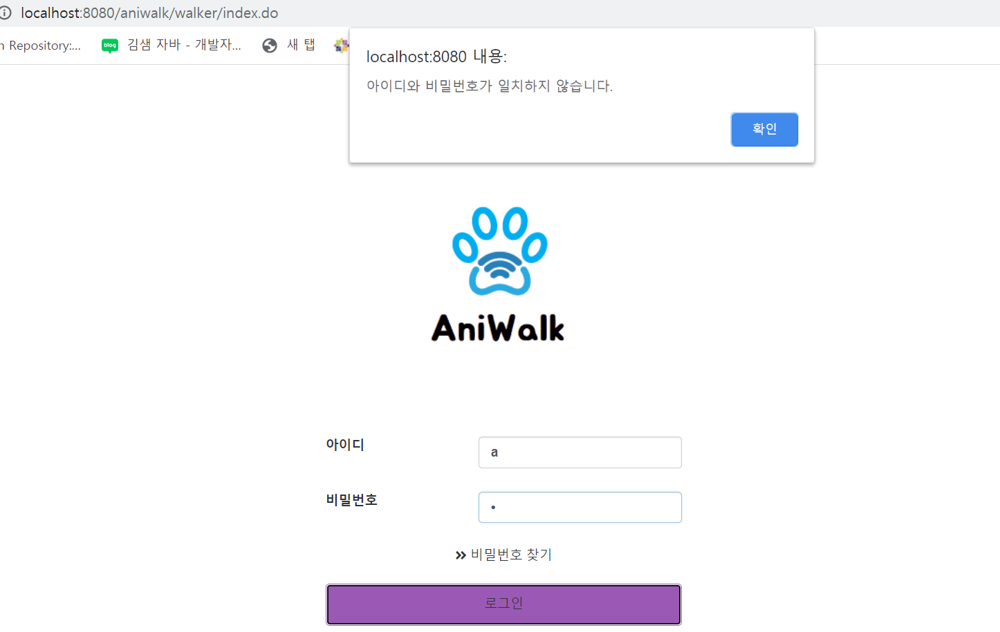
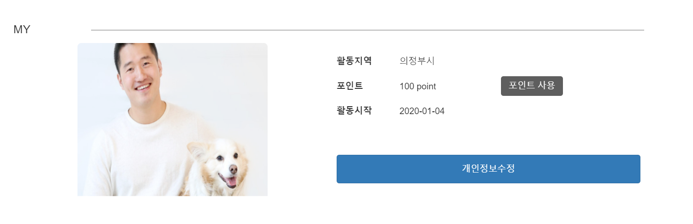
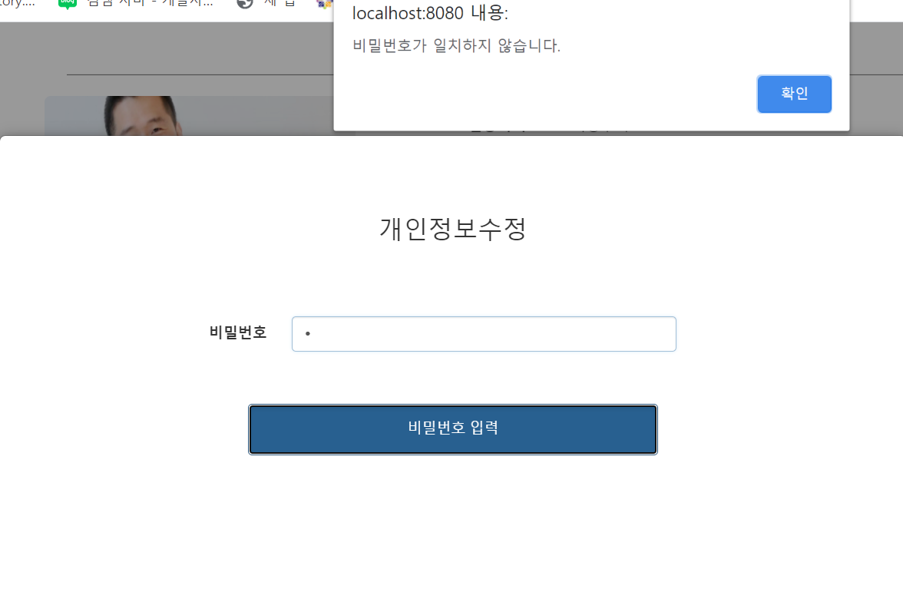
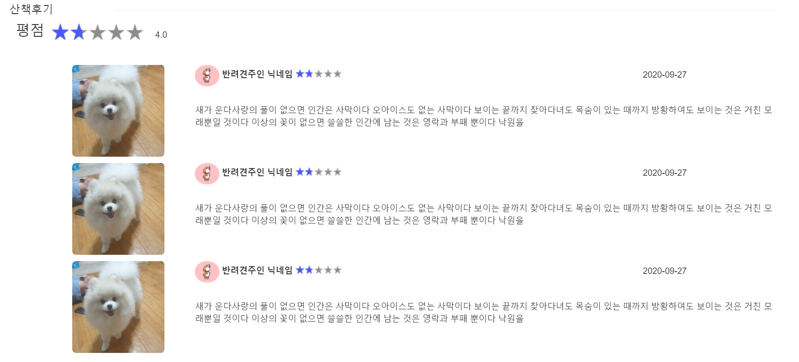
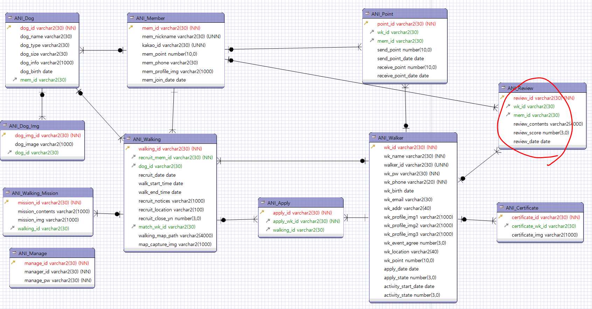

## 9/28(월)  

### walker page

-----

#### 1. walker page 로그인

- walker page 로그인 시 유효성 처리
  - id 존재 확인, id 존재 시 pw와 일치하는지 확인





###### <walkerIndex.jsp> : 뷰에서 로그인 확인 javascript

```javascript
$(document).ready(function(){
		$("#loginbt").click(function(){
		var walker_id = $("#walker_id").val();
		var wk_pw = $("#wk_pw").val();
		
			if(walker_id==""){
				alert("아이디를 입력해주세요");
			}else if(wk_pw==""){ 
				alert("비밀번호를 입력해주세요");
			}else{
				$.ajax({
					url:"/aniwalk/walker/loginCheck.do",
					type: "get",
					data: {
							"walker_id" : walker_id,
							"wk_pw" : wk_pw
						},
					success : function(data){
						switch(data){
						case 1 : alert("아이디를 확인해주세요."); break;
						case 3 : alert("아이디와 비밀번호가 일치하지 않습니다."); break;
						default : 
							location.href="main.do?walker_id="+walker_id;
						}
					},
					error: function(a,b,c){ //ajax 실패시 원인
						alert(c);
					}
				});
				
			}
			
		})
	});
```


###### <WalkerController.java>

```java
//walker 로그인 유효성 검사
	@RequestMapping(value="/walker/loginCheck.do",
			method=RequestMethod.GET,
			produces = "application/json;charset=utf-8")
	public @ResponseBody int login(String walker_id, String wk_pw) {
		int result = walkerService.walkerLogin(walker_id,wk_pw);
		return result;
	}
```


###### <WalkerServiceImpl.java>

```java
@Override
	public int walkerLogin(String walker_id, String wk_pw) {
		HashMap<String, String> map = new HashMap<String, String>();
		map.put("walker_id",walker_id);
		map.put("wk_pw",wk_pw);
		int result = 0;
		int result_id = walkerDao.walkerLogin_id(walker_id);
		if(result_id ==1) {
			int result_idpw = walkerDao.walkerLogin(map);
			if(result_idpw==1) {
				result = 2; //아이디와 비밀번호가 일치
			}else {
				result = 3; //아이디와 비밀번호가 일치하지 않음
			}
		}else {
			result = 1; //아이디가 없음 
		}
		return result;
	}
```


###### <walker.xml>

```xml
<!-- 워커 로그인 -->
	<select id="walkerLogin" parameterType="map" resultType="int">
		select count(*) from ani_walker where walker_id=#{walker_id} and wk_pw=#{wk_pw} 
	</select>
	<select id="walkerLogin_id" parameterType="String" resultType="int">
		select count(*) from ani_walker where walker_id=#{walker_id}
	</select>
```


- 세션에 walker_id 저장

```java
//main
	@RequestMapping("/walker/main.do")
	public String main(HttpServletRequest request, String walker_id) {
		request.getSession().setAttribute("walker_id", walker_id);
		return "walker/main";
	}
```


-------------

#### 2. walker myPage

- 마이페이지에서 walker 정보 확인
- **(미완성) 이미지 불러오기**



###### <walkerMy.jsp>

```jsp
<table>
	<tr>
		<th>활동지역</th>
			<td>${walkerDto.wk_location}</td>
	</tr>
	<tr>
		<th>포인트</th>
		<td>${walkerDto.wk_point} point</td>
		<td>
			<button class="btn btn-default" type="button">포인트 사용</button>
		</td>
	</tr>
	<tr>
		<th>활동시작</th>
		<td>${walkerDto.activity_start_date}</td>	
    </tr>
	<tr>
		<th colspan="3">
		<button id="infoUpdate" class="btn btn-primary" type="button">개인정보수정</button>
		</th>
	</tr>
</table>
```


###### <walker.xml>

```xml
<select id="walkerInfo" parameterType="String" resultType="walker">
	select * from ani_walker where walker_id = #{walker_id}
</select>
```


###### <WalkerController.java>

- walker의 정보를 뷰로 보냄

```java
//walker my page
	@RequestMapping("/walker/my.do")
	public ModelAndView walkerMy(HttpServletRequest request) {
		
		String wallker_id = (String) request.getSession().getAttribute("walker_id");
		WalkerDTO walkerDto = walkerService.walkerInfo(wallker_id);
		return new ModelAndView("walker/my","walkerDto",walkerDto);
	}
```


-----------

#### 3. walker 회원정보 수정

- 비밀번호 확인을 통하여 정보 수정페이지로 이동



###### <walkerMy.jsp>

- 비밀번호 확인

```jsp
<script>
		const infoUpdate = document.getElementById('infoUpdate');
		const modalBg = document.querySelector('.modal-bg');

		infoUpdate.addEventListener('click',function (){
			modalBg.classList.remove('hidden');
		});

		modalBg.addEventListener('click',function(){
			modalBg.classList.add('hidden');
		});
		
		function check(){
			var wk_pw = "${walkerDto.wk_pw}";
			var pw = $('#pw').val();
			if(wk_pw!=pw){
				alert("비밀번호가 일치하지 않습니다.");
				$('#pw').val("");
			}else{
				location.href="myInfo.do";
			}
		}
		
</script>
```


------------

#### 4. 산책 후기를 위한 Table 추가

- walker mypage에 해당 유저에게 올린 후기가 나옴



###### < ERD >

