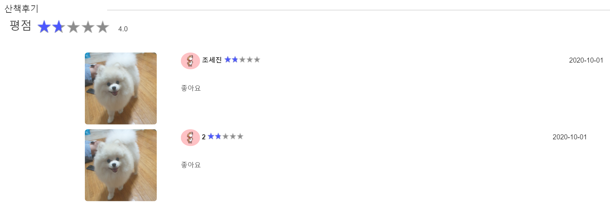

## 9/29(화)  

### walker page

-----

#### 1. walker 산책후기

- walker my page의 산책 후기 DB에서 불러오기
- (미완성) 이미지 불러오는 것 
- (미완성) 평점과 각 유저의 별점





###### <WalkerMy.jsp> : 뷰페이지

```jsp
<div class="subtitle">
	<h4>산책후기</h4>
	<hr width="80%" color="gray"/>
</div>
<div class="review-part">
	<div class="review-score">
		<h3>평점</h3>
		<div class="star-rating">
			<span style="width:30%"></span>
		</div>
		<span>4.0</span>
	</div>
	<c:forEach items="${reviewDtos}" var="reviewDto">
		<div class="list-item">
			
			<ul>
				<li class="bottom-margin">
					
					<label>${reviewDto.mem_nickname}</label>
					<div class="star-rating">
                        <span style="width:30%"></span>
					</div>
					<span class="right"> ${reviewDto.review_date} </span>
				</li>
				<li>
					${reviewDto.review_contents}
				</li>
			</ul>
        </div>
	</c:forEach>
</div>
```


###### <WalkerController.java>

```java
//walker my page
@RequestMapping("/walker/my.do")
public ModelAndView walkerMy(HttpServletRequest request) {
	ModelAndView mav = new ModelAndView();
	
	String wallker_id = (String) request.getSession().getAttribute("walker_id");
	WalkerDTO walkerDto = walkerService.walkerInfo(wallker_id);
	List<WalkerDTO> reviewDtos = walkerService.review(wallker_id);

	mav.addObject("walkerDto", walkerDto);
	mav.addObject("reviewDtos", reviewDtos);
	mav.setViewName("walker/my");
	return mav;
}
```


###### <WalkerServiceImpl.java>

```java
@Override
public List<WalkerDTO> review(String walker_id) {
	return walkerDao.review(walker_id);
}
```


###### <walker.xml>

```java
<select id="review" parameterType="String" resultType="walker">
	select * from ani_review r 
	left outer join ani_walker w
	on r.wk_id = w.wk_id
	left outer join ani_member m
	on m.mem_id = r.mem_id
	where w.walker_id = #{walker_id} 
</select>
```


--------------

### owner page

------------

#### 2. 로그인 시 닉네임 session에 저장

- (수정) 카카오톡 로그인 시 kakao id를 통하여 기존 회원인지 확인하는 방법으로 컬럼의 개수를 이용했는데 mem_nickname을 가져와 존재하는지 확인하는 방법으로 변경
- mem_nickname이 존재 시 닉네임을 session에 저장

###### <member.xml>

```xml
<!--수정 전-->
<select id="check" parameterType="int" resultType="String">
	select count(*) from ani_member where kakao_id = #{kakao_id}
</select>

<!--수정 후-->
<select id="check" parameterType="int" resultType="String">
	select mem_nickname from ani_member where kakao_id = #{kakao_id}
</select>
```


###### <MemberController.java> : 세션에 저장

```java
@RequestMapping("/loginPro.do")
public ModelAndView checkMember(int kakao_id, HttpServletRequest request) {
	ModelAndView mav = new ModelAndView();
	
	String mem_nickname = memverService.joinCheck(kakao_id);
	
	if(mem_nickname == null) {
		mav.setViewName("login");
		return mav;
	} else {
		System.out.println(mem_nickname);
		request.getSession().setAttribute("mem_nickname", mem_nickname);
		mav.addObject("kakao_id", kakao_id);
		mav.setViewName("owner/index");
		return mav;
	}			
}
```

