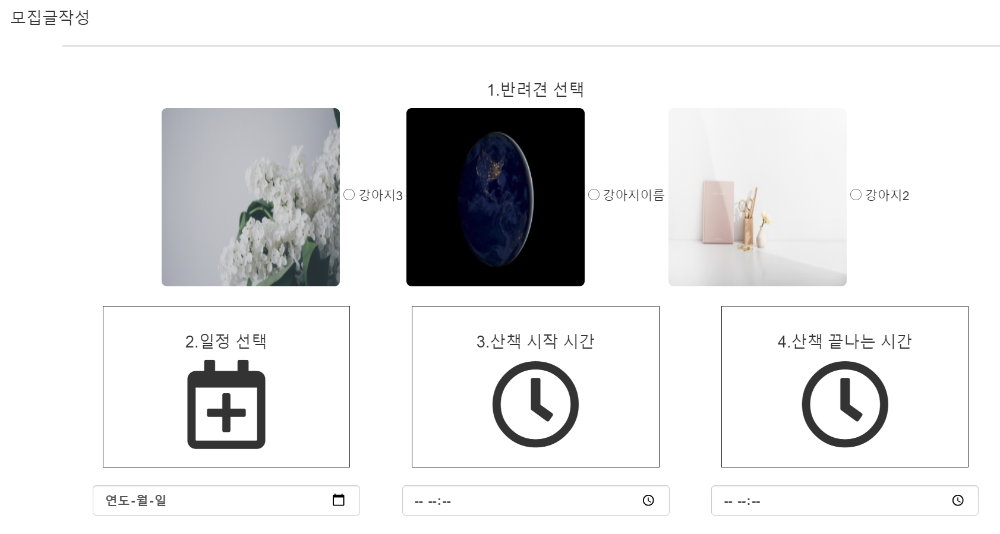
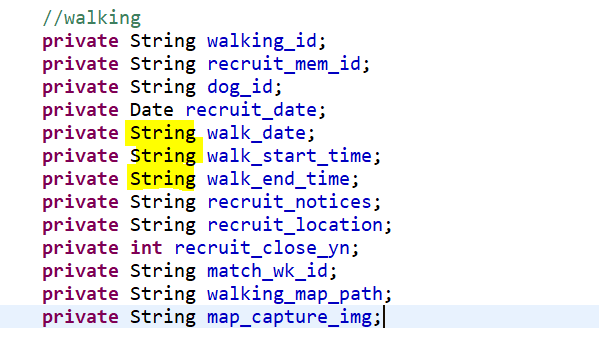

## 9/30(수)  

### owner page

------------

#### 1. 산책 모집글 작성

- (수정) 강아지 주인이 여러 마리의 반려견을 등록해 놓을 수 있으므로 뷰 수정
  - 선택한 반려견의 dog_id(인덱스)를 value값으로 설정
- member, dog, dog_img 테이블을 join하여 필요한 정보 불러오기


###### <ownerRecruit.jsp>

```jsp
<!-- 수정 전 -->
<section>
    <h4>1.반려견 선택</h4>
    <ol>
        <li>
        </li>
        <li><label>반려견 이름</label></li>
    </ol>
</section>

<!-- 수정 후 -->
<section>
    <h4>1.반려견 선택</h4>

    <ol>
        <li>
            <c:forEach var="walkingDto" items="${walkingDtos}" varStatus="mystatus">
                
                <input type="radio" name="dog_id" value="${walkingDto.dog_id}"> 															${walkingDto.dog_name}
            </c:forEach>
        </li>	
    </ol>

</section>
```


###### <WalkingController.java>

```java
//모집글 올리기 
@RequestMapping("/owner/recruit.do")
public ModelAndView recruit(HttpServletRequest request) {
    ModelAndView mav = new ModelAndView();
    String mem_nickname = (String) request.getSession().getAttribute("mem_nickname");

    List<WalkingDTO> walkingDtos = walkingService.recruitDog(mem_nickname);
    System.out.println(walkingDtos);
    String recruit_mem_id = walkingDtos.get(0).getMem_id();

    mav.addObject("recruit_mem_id",recruit_mem_id);
    mav.addObject("walkingDtos", walkingDtos);
    mav.setViewName("owner/recruit");
    return mav;
}
```


###### <walking.xml>

```xml
<select id="recruitDog" parameterType="String" resultType="walking">
    select * from ani_dog d left outer join ani_member m
    on m.mem_id=d.mem_id
    left outer join ani_dog_img i
    on d.dog_id=i.dog_id
    where m.mem_nickname = #{mem_nickname}
</select>
```





- 모집글 DB에 insert

  - 주소는 도로명 주소를 넣음

  ```jsp
  <input type="hidden" id="recruit_location" name="recruit_location" value="">
  
  <script>
  document.getElementById('recruit_location').value = result[0].road_address.address_name;
  </script>
  ```

  

- insert 수행 중 400 에러 발생

  

  - (원인) 값을 넘길 때 data type이 Date인 값이 넘어가지 않아서 발생하는 에러
  - (해결) Dto에서 Date값을 String으로 변경

  


###### <ownerRecruit.jsp>

```jsp
<%@ page language="java" contentType="text/html; charset=UTF-8"
	pageEncoding="UTF-8"%>
<%@ taglib prefix="c" uri="http://java.sun.com/jsp/jstl/core" %>
<!DOCTYPE html>
<html>
<head>
<meta charset="UTF-8">
<title>모집하기</title>
<link rel="stylesheet" type="text/css"
	href="${pageContext.request.contextPath}/static/css/owner.css">
<link rel="stylesheet"
	href="https://maxcdn.bootstrapcdn.com/bootstrap/3.3.2/css/bootstrap.min.css">
<link
	href="https://cdnjs.cloudflare.com/ajax/libs/font-awesome/5.13.0/css/all.min.css"
	rel="stylesheet">
<link rel="stylesheet" href="https://unpkg.com/swiper/swiper-bundle.css">
<!-- 스와이퍼 -->
<script src="https://unpkg.com/swiper/swiper-bundle.js"></script>
<!-- services와 clusterer, drawing 라이브러리 불러오기 -->
<script type="text/javascript"
	src="//dapi.kakao.com/v2/maps/sdk.js?appkey=2521c7cc3e67ced68e19182536406c54&libraries=services,clusterer,drawing"></script>

</head>
<body>
	<form class="recruit-write" action="/aniwalk/owner/recruitInsert.do">
	<input type="hidden" value="${recruit_mem_id}" name="recruit_mem_id">
		<div>
			<h4>모집글작성</h4>
			<hr width="90%" color="gray">
		</div>

		<section>
			<h4>1.반려견 선택</h4>
			
			<ol>
				<li>
				<c:forEach var="walkingDto" items="${walkingDtos}" varStatus="mystatus">
				
					<input type="radio" name="dog_id" value="${walkingDto.dog_id}"> 								${walkingDto.dog_name}
				</c:forEach>
				</li>	
			</ol>
			 
		</section>
		<section class="date-select">
			<div class="form-group">
				<div>
					<h4>2.일정 선택</h4>
					<i class="far fa-calendar-plus"></i>
				</div>
				<label>
					<input type="date" class="form-control" name="walk_date">
				</label>
			</div>
			<div class="form-group">
				<div>
					<h4>3.산책 시작 시간</h4>
					<i class="far fa-clock"></i>
				</div>
				<label>
					<input type="time" class="form-control" name="walk_start_time">
				</label>
			</div>
			<div class="form-group">
				<div>
					<h4>4.산책 끝나는 시간</h4>
					<i class="far fa-clock"></i>
				</div>
				<label>
					<input type="time" class="form-control" name="walk_end_time">
				</label>
			</div>
		</section>
		<section>
			<h4>5.주소선택</h4>
			<input type="text" id="addr"  placeholder="주소검색" ><button type="button" onclick="searchAddr()">검색</button>
			<input type="hidden" id="recruit_location" name="recruit_location" value="">
			<div id="map" style="width: 500px; height: 400px;" class="kakao-map"></div>
			<label id="centerAddr">현재주소</label>
		</section>
		<section class="notice">
			<h4>6.주의사항</h4>
			<label> <textarea class="form-control" cols="200" name="recruit_notices"></textarea>
			</label>
		</section>
		<div class="btn-line">
			<button type="submit" class="btn btn-primary">신청하기</button>
			<button type="button" class="btn btn-default">취소</button>
		</div>
	</form>

</body>

<script>
//카카오톡지도 생성
var mapContainer = document.getElementById('map'), // 지도를 표시할 div
    mapOption = {
        center: new kakao.maps.LatLng(33.450701, 126.570667), // 지도의 중심좌표
        level: 5 // 지도의 확대 레벨
    };
var map = new kakao.maps.Map(mapContainer, mapOption); // 지도를 생성합니다

//지도에 표시된 마커 객체를 가지고 있을 배열입니다
var markers = [];

//장소 검색 객체를 생성합니다
var ps = new kakao.maps.services.Places();  

//주소-좌표 변환 객체를 생성합니다
var geocoder = new kakao.maps.services.Geocoder();

// 키워드 검색을 요청하는 함수
function searchPlaces() {
    var keyword = document.getElementById('keyword').value;
    if (!keyword.replace(/^\s+|\s+$/g, '')) {
        alert('키워드를 입력해주세요!');
        return false;
    }
    // 장소검색 객체를 통해 키워드로 장소검색을 요청합니다
    ps.keywordSearch( keyword, placesSearchCB); 
}

//좌표로 주소 불러오기
function coord2Address(coord) {
	 var callback = function(result, status) {
         if (status === kakao.maps.services.Status.OK) {
         	var detailAddr = !!result[0].road_address ? '<div>도로명주소 : ' + result[0].road_address.address_name + '</div>' : '';
            detailAddr += '<div>지번 주소 : ' + result[0].address.address_name + '</div>';
            document.getElementById('centerAddr').innerHTML = detailAddr;
            
            document.getElementById('recruit_location').value = result[0].road_address.address_name;
         }
     };
     message = '<div style="padding:5px;">현재위치</div>';
     displayMarker(coord, message);
     geocoder.coord2Address(coord.getLng(), coord.getLat(), callback);
}

// HTML5의 geolocation으로 사용할 수 있는지 확인합니다 
if (navigator.geolocation) {
    // GeoLocation을 이용해서 접속 위치를 얻어옵니다
    navigator.geolocation.getCurrentPosition(function(position) {
        
        var lat = position.coords.latitude, // 위도
            lon = position.coords.longitude; // 경도
        
        var locPosition = new kakao.maps.LatLng(lat, lon), // 마커가 표시될 위치를 geolocation으로 얻어온 좌표로 생성합니다
            message = '<div style="padding:5px;">현재위치</div>'; // 인포윈도우에 표시될 내용입니다
        
        // 마커와 인포윈도우를 표시합니다
        displayMarker(locPosition, message);
    });
    
} else { // HTML5의 GeoLocation을 사용할 수 없을때 마커 표시 위치와 인포윈도우 내용을 설정합니다
    var locPosition = new kakao.maps.LatLng(33.450701, 126.570667),    
        message = 'geolocation을 사용할수 없어요..'
        
    displayMarker(locPosition, message);
}

// 지도에 마커와 인포윈도우를 표시하는 함수입니다
function displayMarker(locPosition, message) {
	removeMarker();
    var iwContent = message, // 인포윈도우에 표시할 내용
        iwRemoveable = true;

    // 인포윈도우를 생성합니다
    var infowindow = new kakao.maps.InfoWindow({
        content : iwContent,
        removable : iwRemoveable
    });
 	//마커를 생성합니다
    var marker = new kakao.maps.Marker({
        map: map,
        position: locPosition
    });
    // 인포윈도우를 마커위에 표시합니다 
    // infowindow.open(map, marker);
    
    // 마커가 지도 위에 표시되도록 설정합니다
    marker.setMap(map);
    
	// 생성된 마커를 배열에 추가합니다
    markers.push(marker);
    
    // 지도 중심좌표를 접속위치로 변경합니다
    map.setCenter(locPosition);
};

//일반 지도와 스카이뷰로 지도 타입을 전환할 수 있는 지도타입 컨트롤을 생성합니다
var mapTypeControl = new kakao.maps.MapTypeControl();

// 지도에 컨트롤을 추가해야 지도위에 표시됩니다
// kakao.maps.ControlPosition은 컨트롤이 표시될 위치를 정의하는데 TOPRIGHT는 오른쪽 위를 의미합니다
map.addControl(mapTypeControl, kakao.maps.ControlPosition.TOPRIGHT);

// 지도 확대 축소를 제어할 수 있는  줌 컨트롤을 생성합니다
var zoomControl = new kakao.maps.ZoomControl();
map.addControl(zoomControl, kakao.maps.ControlPosition.RIGHT);

function searchAddr(){
	var addr = document.getElementById('addr').value
	geocoder.addressSearch(addr, function(result, status) {
	    // 정상적으로 검색이 완료됐으면 
	     if (status === kakao.maps.services.Status.OK) {
	        var coords = new kakao.maps.LatLng(result[0].y, result[0].x);
	        coord2Address(coords);
	     }
	});    
}

//지도 위에 표시되고 있는 마커를 모두 제거합니다
function removeMarker() {
    for ( var i = 0; i < markers.length; i++ ) {
        markers[i].setMap(null);
    }   
    markers = [];
}
</script>

</html>
```


###### <walking.xml>

```xml
<insert id="recruitInsert" parameterType="walking">
    insert into ani_walking(walking_id, recruit_mem_id, dog_id, walk_date, 				     walk_start_time, walk_end_time, recruit_notices, recruit_location)
    values('walking'||lpad(seq_walking.nextval,5,0),#{recruit_mem_id},#{dog_id},
    to_date(#{walk_date},'YYYY-MM-DD'), #{walk_start_time},#{walk_end_time},
    #{recruit_notices},#{recruit_location})	
</insert>
```


###### <WalkingController.java>

```java
@RequestMapping("/owner/recruitInsert.do")
public String recruitInsert(WalkingDTO walking) {
walkingService.recruitInsert(walking);
return "owner/index";
}
```

