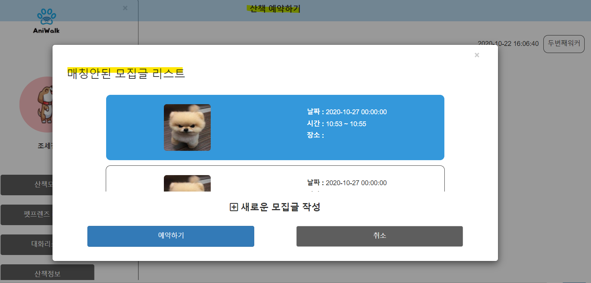
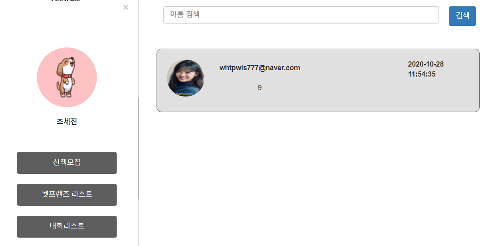
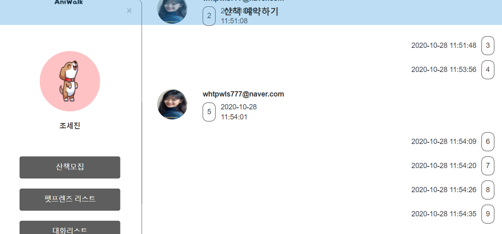
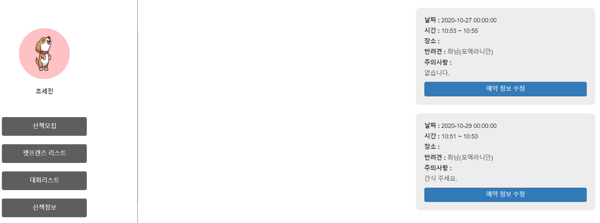

## 10/27(화)

### Owner

----

#### 1. 1:1 채팅

- (수정) 웹소켓을 통하여 모든 세션의 id에 채팅 내용을 전달했던 것에서 정해진 id에게만 채팅 내용을 전송

  - json의 형식으로 보내는 사람과 받는 사람의 id를 정의

  ```javascript
  //메시지를 보낸 사람
  var msg = {
      type : "register", //메시지 구분하는 구분자 - 상대방 아이디와 메시지 포함
      userid : $("#chat_id").val()
  };
  ws.send(JSON.stringify(msg));
  
  //메시지를 받는 사람
  var msg = {
      type : "chat", //메시지 구분하는 구분자 - 상대방 아이디와 메시지 포함해서 보냄
      target : $("#walker_id").val(),
      message : inputMessage.value
  };
  ws.send(JSON.stringify(msg));
  ```

  - 받는 사람의 id가 세션에 저장되어 있는 상태인 경우 웹소켓을 통하여 채팅 내용 전달
  - 아닌 경우 웹소켓을 통하여 채팅 내용을 전달하지 않음


###### <MyHandler.java> : 웹소켓 핸들러

```java
package kr.pandorabox.aniwalk.chat;

import java.util.ArrayList;
import java.util.HashMap;
import java.util.List;
import java.util.Map;

import org.json.JSONObject;
import org.springframework.stereotype.Component;
import org.springframework.web.socket.CloseStatus;
import org.springframework.web.socket.TextMessage;
import org.springframework.web.socket.WebSocketSession;
import org.springframework.web.socket.handler.TextWebSocketHandler;

import com.fasterxml.jackson.databind.util.JSONPObject;

@Component
public class MyHandler extends TextWebSocketHandler{
	//연결 요청 처리 
        //메시지 받기, 메시지 전달

	//WebSocketSession 클라이언트 당 하나씩 생성, 해당 클라이언트와 연결된 웹소켓을 이용할 수 있는 객체  
	//해당 객체를 통해 메시지를 주고 받음

	private List<WebSocketSession> users;
	private Map<String, Object> userMap;
	
	public MyHandler() {
		users= new ArrayList<WebSocketSession>();
		userMap = new HashMap<String,Object>();
	}

	@Override
        //소켓 연결 생성 후 실행 메서드
	public void afterConnectionEstablished(WebSocketSession session) throws Exception {
		System.out.println("TextWebSocketHandler : 연결 생성!"+session);
		users.add(session);
	}

	@Override
        //메시지 수신 후 실행 메서드
	protected void handleTextMessage(WebSocketSession session, TextMessage message) throws Exception {
		JSONObject object = new JSONObject(message.getPayload());
		String type = object.getString("type");
		
		if(type != null && type.equals("register") ) {
			//등록 요청 메시지
			String user = object.getString("userid");

			//아이디랑 Session이랑 매핑 >>> Map
			userMap.put(user, session);
		}else if(type.equals("chat")){
			//채팅 메시지 : 상대방 아이디를 포함해서 메시지를 보낼것이기 때문에
			//Map에서 상대방 아이디에 해당하는 WebSocket 꺼내와서 메시지 전송
			//String user = object.getString("userid");
			String target = object.getString("target");
		
			WebSocketSession ws = (WebSocketSession)userMap.get(target);
			
			String msg = object.getString("message")+ "|" + target;
			if(ws !=null ) {
				ws.sendMessage(new TextMessage(msg));
			}
		}
	}

	@Override
        //연결 해제 후 실행 메서드
	public void afterConnectionClosed(WebSocketSession session, CloseStatus status) throws Exception {
		System.out.println("TextWebSocketHandler : 연결 종료!");
		users.remove(session);
	}	
}
```


###### <ownerTalkContent.jsp>

```java
<script type="text/javascript">
//채팅
//현재시간
function getTimeStamp() {
    var d = new Date();
    var s =
    leadingZeros(d.getFullYear(), 4) + '-' +
    leadingZeros(d.getMonth() + 1, 2) + '-' +
    leadingZeros(d.getDate(), 2) + ' ' +

    leadingZeros(d.getHours(), 2) + ':' +
    leadingZeros(d.getMinutes(), 2) + ':' +
    leadingZeros(d.getSeconds(), 2);

    return s;
}   

function leadingZeros(n, digits) {
    var zero = '';
    n = n.toString();

    if (n.length < digits) {
    for (i = 0; i < digits - n.length; i++)
    zero += '0';
    }
    return zero + n;
}

var inputMessage = document.getElementById('inputMessage'); //메시지 내용
var ws;
var userid = $("#chat_id").val(); //파라미터로 넘겨서 설정할 (내) 아이디

function connect() {
    //웹소켓 객체 생성하는 부분
    //핸들러 등록(연결 생성, 메시지 수신, 연결 종료)

    //url 연결할 서버의 경로
    ws = new WebSocket('ws://localhost:8080/aniwalk/chat');	

    ws.onopen = function() {
        console.log('연결 생성');
        register();
    };
    ws.onmessage = function(e) {
        var data = e.data;
        //alert("받은 메시지 : " + data);
        addMsg(data);
    };
    ws.onclose = function() {
        console.log('연결 끊김');
    };
}

//원래 채팅 메시지에 방금 받은 메시지 더해서 설정하기
function addMsg(msg) { 
    var NowTime = getTimeStamp();
    var message = event.data.split("|");
    var sender = message[1];
    var content = message[0];
    var chatToInsert ='';
    if (content == "") {

    } else {
        if(sender != $("#chat_id").val()){ //내가 보낸 메시지
        //나
        chatToInsert += '<div class="my"><ul><li style="min-width: 60px"><span>'+NowTime+'</span></li>';
        chatToInsert += '<li><div class="my-talk-content">'+content+'</div></li></ul></div>';
        $("#messageWindow").append(chatToInsert)
        }else{ //상대방
        chatToInsert += '<div class="you">';
        chatToInsert += '';
        chatToInsert += '<ul><li><label>'+sender+'</label></li><li><div>'+content+'</div><span>'+NowTime+'</span></li></ul></div>';
        $("#messageWindow").append(chatToInsert)	
        }
    }
}

//메시지 수신을 위한 서버에 id 등록하기
function register() { 
    var msg = {
    type : "register", //메시지 구분하는 구분자 - 상대방 아이디와 메시지 포함해서 보냄
    userid : $("#chat_id").val()
	};
	ws.send(JSON.stringify(msg));
}

//메시지를 보냈을 때
function sendMsg() {
	if (inputMessage.value == "") {
	} else {	//내가 메시지 보냈을 때
	var NowTime = getTimeStamp();
	console.log('send()')
	var chatToInsert ='';
	chatToInsert += '<div class="my"><ul><li style="min-width: 60px">	<span>'+NowTime+'</span></li>';
	chatToInsert += '<li><div class="my-talk-content">'+inputMessage.value+'</div></li></ul></div>';
	$("#messageWindow").append(chatToInsert)

	var trans_object = {
	'walker_id' : $("#walker_id").val(),
	'mem_nickname' : $("#chat_id").val(),
	'send_nickname' : $("#chat_id").val(),
	'receive_nickname' : $("#walker_id").val(),
	'chat_date' : NowTime,
	'contents' : inputMessage.value
	}
	var trans_json = JSON.stringify(trans_object); //json으로 변환

	$.ajax({ //mongodb insert
	url : "/aniwalk/owner/chatInsert.do",
	type: 'post',
	dataType : 'json',
	data : trans_json,
	contentType : 'application/json',
	momeType : 'application/json',
	success: function(retVal){
		//alert("success"+retVal.val);
	},
		error : function(retVal,status,er){
		//alert("error"+retVal);
	}
	});

}//else 

var msg = {
	type : "chat", //메시지 구분하는 구분자 - 상대방 아이디와 메시지 포함해서 보냄
	target : $("#walker_id").val(),
	message : inputMessage.value
	};
	ws.send(JSON.stringify(msg));
	inputMessage.value="";
};

//페이지가 로딩되면 connect 실행
$(function() {
	connect();
	$('#send').on("click", function() {
	sendMsg();

	})
});

//     엔터키를 통해 send함
function enterkey() {
    if (window.event.keyCode == 13) {
    send();
    }
}
//     채팅이 많아져 스크롤바가 넘어가더라도 자동적으로 스크롤바가 내려가게함
window.setInterval(function() {
    var elem = document.getElementById('messageWindow');
    elem.scrollTop = elem.scrollHeight;
    }, 0);

</script>
```


-------

#### 2. 매칭되지 않은 모집글 list

- 채팅창에서 산책 예약하기 클릭 시 매칭되지 않은 모집글 list를 모달창에 띄움
  - 처음 채팅창 뷰를 띄울 때 매칭되지 않은 모집글 list 데이터를 controller에서 보낸다.

###### <ChatController.java>

```java
//추가 내용
 List<WalkingDTO> nonMatchList = service.nonMatchList(mem_nickname);
```


```java
//채팅 content
@RequestMapping("/owner/talkContent.do")
public ModelAndView chatFind(HttpServletRequest req, String walker_id) {
    System.out.println("walker_id 들어오는지 확인====>"+walker_id);

    ModelAndView mav = new ModelAndView();

    String mem_nickname = (String) req.getSession().getAttribute("mem_nickname");
    Map<String, Object> searchCondition = new HashMap<String, Object>();
    searchCondition.put("mem_nickname", mem_nickname);
    //walker_id도 추가하기
    searchCondition.put("walker_id", walker_id);
    System.out.println(searchCondition.get("walker_id") +"find walker_id");
    System.out.println(searchCondition.get("mem_nickname")+"find mem_nickname");

    //매칭안된 나의 산책 모집글 가져오기
    List<WalkingDTO> nonMatchList = service.nonMatchList(mem_nickname);
 
    //등록 서비스 호출
    List<ChatDTO> chatDtos = service.chatFind(searchCondition);
    System.out.println("size : "+chatDtos.size());
    mav.addObject("nonMatchList", nonMatchList);
    mav.addObject("walker_id", walker_id);
    mav.addObject("mem_nickname", mem_nickname);
    mav.addObject("chatDtos", chatDtos);
    mav.setViewName("owner/talkContent");
    return mav;
}
```


###### <chat.xml>

```xml
<select id="nonMatchList" parameterType="String" resultType="walking">
      <![CDATA[
      select * from ani_walking w left outer join ani_member m
      on w.recruit_mem_id = m.mem_id
      left outer join ani_dog d
      on d.mem_id = d.mem_id
      left outer join ani_dog_img i
      on i.dog_id = d.dog_id
      where m.mem_nickname = #{mem_nickname}
      and w.recruit_close_yn = 0
      and w.match_wk_id is null
      ]]> 
</select>
```





-------------

## 10/28(수)

### owner

--------

#### 1. 1:1채팅 오류 수정

- 웹소켓으로 보낸 target의 id를 사용하여 대화 진행 시 상대방이 보낸 말풍선의 id 칸에 나의 id가 추가된다. 

```javascript
//채팅 페이지의 javascript
//상대방이 보낸 메시지의 id 부분을 sender에서 target으로 변경

function addMsg(msg) { 
    var wk_profile_img1 = $('#wk_profile_img1').val();
    var NowTime = getTimeStamp();
    var message = event.data.split("|");
    var sender = message[1];
    var target = $('#walker_id').val();
    var content = message[0];
    
    var chatToInsert ='';
    if (content == "") {

    } else {
        if(sender != $("#chat_id").val()){ //내가 보낸 메시지
            //나
            chatToInsert += '<div class="my"><ul><li style="min-width: 60px"><span>'+NowTime+'</span></li>';
            chatToInsert += '<li><div class="my-talk-content">'+content+'</div></li></ul></div>';
            $("#messageWindow").append(chatToInsert)
        }else{ //상대방
            chatToInsert += '<div class="you">';
            chatToInsert += '';
            chatToInsert += '<ul><li><label>'+target+'</label></li><li><div>'+content+'</div><span>'+NowTime+'</span></li></ul></div>';
            $("#messageWindow").append(chatToInsert)	
        }
    }
}
```


-------

#### 2. 채팅 프로필 사진 추가

- controller에서 상대방의 프로필 사진의 주소를 가져와 뷰로 보내준다.
- 프로필 주소 또한 mongodb에 추가하여 추후에 채팅 리스트를 불러올 때 사용


###### <chat.xml>

```xml
<select id="getWalkerProfile" parameterType="String" resultType="String">
    select wk_profile_img1 from ani_walker where walker_id = #{walker_id} 
</select>
```


###### <ChatController.java> : 워커 프로필사진 주소값을 뷰에 보내주는 코드 추가

```java
//채팅 페이지 컨트롤러
String wk_profile_img1 = service.getWalkerProfile(walker_id);

mav.addObject("wk_profile_img1", wk_profile_img1);
```


###### <ownerTalkContent.jsp> : 대화 내용 db에서 불러오는 곳에 프로필 주소 추가 / mongodb에 프로필 사진의 주소 넣기 

```jsp
<c:forEach var="chatDto" items="${chatDtos}">
    <c:choose> 
        <c:when test="${chatDto.send_nickname eq mem_nickname}"> <!-- 내가 보낸 내용 -->
            <div class="my">
                <ul>
                    <li style="min-width: 60px">
                        <span>${chatDto.chat_date}</span>
                    </li>
                    <li>
                        <div class="my-talk-content">${chatDto.contents }</div>
                    </li>
                </ul>
            </div>
        </c:when>
        <c:otherwise><!-- 상대방이 보낸 내용 -->
            <div class="you">
                
                <ul>
                    <li>
                        <label>${chatDto.walker_id} </label>
                    </li>
                    <li>
                        <div>${chatDto.contents }</div>
                        <span>${chatDto.chat_date}</span>
                    </li>
                </ul>
            </div>
        </c:otherwise>
    </c:choose>
</c:forEach>


<script>
var trans_object = {
    'walker_id' : $("#walker_id").val(),
    'mem_nickname' : $("#chat_id").val(),
    'send_nickname' : $("#chat_id").val(),
    'receive_nickname' : $("#walker_id").val(),
    'chat_date' : NowTime,
    'contents' : inputMessage.value,
    'wk_profile_img1' : wk_profile_img1
}
var trans_json = JSON.stringify(trans_object); //json으로 변환

$.ajax({ //mongodb insert
    url : "/aniwalk/owner/chatInsert.do",
    type: 'post',
    dataType : 'json',
    data : trans_json,
    contentType : 'application/json',
    momeType : 'application/json',
    success: function(retVal){
        //alert("success"+retVal.val);
    },
    error : function(retVal,status,er){
        //alert("error"+retVal);
    }
});
</script>
```


###### <onwerTalkList.jps>  : 채팅 리스트에 프로필 주소 추가

```jsp
<div class="list-part" >
    <c:forEach var="chatList" items="${chatLists}">
        <div class="talk-item">
            <ul>
                <li>
                    <a href="/aniwalk/owner/talkContent.do?walker_id=${chatList.walker_id}"></a>
                </li>
                <li>
                    <div>
                        <label>${chatList.walker_id}</label>
                        <span>${chatList.contents}</span>
                    </div>
                </li>
            </ul>
            <label>${chatList.chat_date}</label>
        </div>
    </c:forEach>
</div>
```


- 대화리스트 페이지




- 대화 내용 페이지




------------------

#### 3. 채팅창에서 산책 매칭하기

- 대화창에서 산책 예약하기 클릭 시 뜨는 매칭이 안 된 나의 모집글 중 하나를 선택하여 현재 대화 상대의 워커와 매칭하게 함
- 매칭을 위해 모집글을 선택 후 예약하기 버튼을 누르면 대화창에 매칭된 모집글의 정보가 뜬다.
- (미완성) 워커 페이지는 아직 미완성 


###### <ownerTalkContent.jsp>

- 모집글의 정보를 불러옴

  - 선택된 모집글의 index를 matchingIndex의 변수에 저장했고, 컨트롤러로 불러온 dto의 정보를 자바스크립트에서 선택적으로 사용하기 위하여 matchingIndex를 사용했을 때 값이 불러오지 않았음

  ```javascript
  //matchingIndex가 사용되지 않음
  
  // 시행착오 1.
  var walk_date = "${nonMatchList[matchingIndex].walk_date}";
  //시행착오 2.
  var walk_date = "${nonMatchList["+matchingIndex+"].walk_date}";
  ```

  - 결국, 2차원 배열을 만들어 모집글에 대한 정보를 담음 자바스크립트에서 2차원 배열 생성 시 nonMatchList=[ ] [ ];을 사용할 수 없어 아래와 같은 방식을 사용

  ```javascript
  var nonMatchList = [];
  var cnt = 0;
  <c:forEach var="one" items="${nonMatchList}">
      //nonMatchList[cnt] = '${one}'
      nonMatchList[cnt] = []; 
      nonMatchList[cnt][0] = '${one.walk_date}';
      nonMatchList[cnt][1] = '${one.walk_start_time}';
      nonMatchList[cnt][2] = '${one.walk_end_time}';
      nonMatchList[cnt][3] = '${one.recruit_location}'
      nonMatchList[cnt][4] = '${one.dog_name}'  
      nonMatchList[cnt][5] = '${one.recruit_notices}' //주의사항
      nonMatchList[cnt][6] = '${one.dog_type}' //견종
      nonMatchList[cnt][7] = '${one.walking_id}' //walking 테이블 업데이트를 위한 것
      cnt += 1;
  </c:forEach>
  ```

- 예약하기 버튼 클릭 시 선택 모집글에 대한 정보를 mongodb에 저장
- ajax를 사용하여 walking 테이블의 매칭된 워커 컬럼과 모집글 모집 여부의 컬럼을 업데이트
- 워커에게 모집글 정보를 보내기 위하여 json 형식으로 소켓에 보냄
  
  - type을 reservation으로 설정
- 내 채팅에 예약된 모집글 정보를 띄움 

```jsp
<!--전체 코드--> 
<script>
	//매칭안된 모집글 클릭시 이벤트
	const listItem = document.querySelectorAll('.list-item');
	var matchingIndex = 0; 
	for(let i=0; i<listItem.length; i++) {
		listItem[i].addEventListener('click',function(){
			for(let j=0; j<listItem.length; j++){
				listItem[j].classList.remove('on-click');
			}
			listItem[i].classList.add('on-click');
			matchingIndex = i;
			console.log("matchingIndex::"+matchingIndex);
			
		});
	}
	
	//예약하기 버튼 클릭 시 이벤트
	function reservation(){
		var nonMatchList = [];
		var cnt = 0;
		<c:forEach var="one" items="${nonMatchList}">
			//nonMatchList[cnt] = '${one}'
			nonMatchList[cnt] = [];
			nonMatchList[cnt][0] = '${one.walk_date}';
			nonMatchList[cnt][1] = '${one.walk_start_time}';
			nonMatchList[cnt][2] = '${one.walk_end_time}';
			nonMatchList[cnt][3] = '${one.recruit_location}'
			nonMatchList[cnt][4] = '${one.dog_name}'  
			nonMatchList[cnt][5] = '${one.recruit_notices}' //주의사항
			nonMatchList[cnt][6] = '${one.dog_type}' //견종
			nonMatchList[cnt][7] = '${one.walking_id}' //walking 테이블 업데이트를 위한 것
			cnt += 1;
		</c:forEach>
		console.log("버튼 클릭 시: nonnonMatchList:"+nonMatchList[matchingIndex][0]);
		console.log("버튼 클릭 시: matchingIndex:"+matchingIndex);
		//mongodb에 insert
		var trans_object = {
       		'walker_id' : $("#walker_id").val(),
       		'mem_nickname' : $("#chat_id").val(),
       		'send_nickname' : $("#chat_id").val(),
       		'receive_nickname' : $("#walker_id").val(),
			'walk_date' : nonMatchList[matchingIndex][0],
			'walk_start_time' : nonMatchList[matchingIndex][1],
			'walk_end_time' : nonMatchList[matchingIndex][2],
			'recruit_location' : nonMatchList[matchingIndex][3],
			'dog_name' : nonMatchList[matchingIndex][4],
			'recruit_notices' : nonMatchList[matchingIndex][5],
       		'wk_profile_img1' : $('#wk_profile_img1').val(),
       		'dog_type' : nonMatchList[matchingIndex][6]
		
       	}
       	var trans_json = JSON.stringify(trans_object); //json으로 변환
       	
       	$.ajax({ //mongodb insert
       		url : "/aniwalk/owner/chatInsert.do",
       		type: 'post',
       		dataType : 'json',
       		data : trans_json,
       		contentType : 'application/json',
       		momeType : 'application/json',
       		success: function(retVal){
       			//alert("success"+retVal.val);
       		},
       		error : function(retVal,status,er){
       			//alert("error"+retVal);
       		}
       	});
		
		//walking table update
		$.ajax({
				url: "/aniwalk/chat/walkingUpdate.do" ,
				type: "get",
				data:  {
							"walking_id" : nonMatchList[matchingIndex][7],
							"wk_id" : $('#wk_id').val()
						},
				success: function(data){ //익명으로 함수 생성
					console.log("data 업데이트::"+data);
				},
				error: function(a,b,c){ //ajax 실패시 원인
					alert("에러"+c);
				}
			})
		
		//소켓에 예약정보 보내기
		var msg = {
			type : "reservation", //메시지 구분하는 구분자 - 상대방 아이디와 메시지 포함해서 보냄
			target : $("#walker_id").val(),
			walk_date : nonMatchList[matchingIndex][0],
			walk_start_time : nonMatchList[matchingIndex][1],
			walk_end_time : nonMatchList[matchingIndex][2],
			recruit_location : nonMatchList[matchingIndex][3],
			dog_name : nonMatchList[matchingIndex][4],
			recruit_notices : nonMatchList[matchingIndex][5],
			dog_type : nonMatchList[matchingIndex][6]
		};
		ws.send(JSON.stringify(msg));
		
		//내 채팅창에 추가
		var chatToInsert ='';
		chatToInsert += '<div class="reserve-box-my"><ul><li><label>날짜 : </label><span>'+nonMatchList[matchingIndex][0]+'</span></li>';
		chatToInsert += '<li><label>시간 : </label><span>'+nonMatchList[matchingIndex][1]+' ~ '+nonMatchList[matchingIndex][2]+'</span></li>';
		chatToInsert += '<li><label>장소 : </label><span>'+nonMatchList[matchingIndex][3]+'</span></li>';
		chatToInsert += '<li><label>반려견 : </label><span>'+nonMatchList[matchingIndex][4]+'('+nonMatchList[matchingIndex][6]+')</span></li>';
		chatToInsert += '<li><label>주의사항 : </label><div>'+nonMatchList[matchingIndex][5]+'</div></li></ul>';
		chatToInsert += '<button class="btn btn-primary" type="button">예약 정보 수정</button></div>';

		$("#messageWindow").append(chatToInsert)	
	}
</script>
```


###### <MyHandler.java> : 소켓 핸들러

- type이 reservation인 것을 추가하여 워커 매칭 시 보낼 데이터 정의

```java
@Override
//메시지 수신 후 실행 메서드
protected void handleTextMessage(WebSocketSession session, TextMessage message) throws Exception {
    System.out.println("TextWebSocketHandler : 메시지 수신!");

    JSONObject object = new JSONObject(message.getPayload());
    String type = object.getString("type");

    if(type != null && type.equals("register") ) {
        //등록 요청 메시지
        String user = object.getString("userid");

        //아이디랑 Session이랑 매핑 >>> Map
        userMap.put(user, session);
    }else if(type.equals("chat")){
        //채팅 메시지 : 상대방 아이디를 포함해서 메시지를 보낼것이기 때문에
        //Map에서 상대방 아이디에 해당하는 WebSocket 꺼내와서 메시지 전송
        //String user = object.getString("userid");
        String target = object.getString("target");

        WebSocketSession ws = (WebSocketSession)userMap.get(target);

        String msg = type+"|"+object.getString("message")+ "|" + target;

        if(ws !=null ) {
            ws.sendMessage(new TextMessage(msg));
        }
    }else if(type.equals("reservation")) {
        String target = object.getString("target");
        WebSocketSession ws = (WebSocketSession)userMap.get(target);
        String walk_date = object.getString("walk_date");
        String walk_start_time = object.getString("walk_start_time");
        String walk_end_time = object.getString("walk_end_time");
        String recruit_location = object.getString("recruit_location");
        String dog_name = object.getString("dog_name");
        String recruit_notices = object.getString("recruit_notices");
        String dog_type = object.getString("dog_type");

        String msg = type+"|"+target+"|"+walk_date+"|"+walk_start_time+"|"+walk_end_time+"|"+recruit_location+"|"+dog_name+"|"+recruit_notices+"|"+dog_type;
        System.out.println("msg::::"+msg);
        if(ws !=null ) {
            ws.sendMessage(new TextMessage(msg));
        }
    }
}
```


###### <ChatController.java> : walking 테이블 update

```java
//오너 채팅창에서 예약하기 버튼 클릭시 walking 테이블 update
@RequestMapping(value="/chat/walkingUpdate.do",
method = RequestMethod.GET,
produces = "application/text;charset=utf-8")
public @ResponseBody int getWalkerProfile(String walking_id,String wk_id) {
    Map<String, String> map = new HashMap<String, String>();
    map.put("walking_id", walking_id);
    map.put("wk_id", wk_id);
    int result = service.walkingUpdate(map);
return result;
}

```


###### <chat.xml> : walking 테이블 update

```xml
<update id="walkingUpdate" parameterType="Map">
    update ani_walking set recruit_close_yn=1, match_wk_id =#{wk_id} where walking_id =#{walking_id}
</update>
```





--------


## 다른 날짜에 쓰기 

### walker 페이지

-------

#### 1. 채팅창에서 산책 매칭하기

- 오너가 채팅 예약 신청을 보냈을 때 소켓에서 받은 데이터 받기
- 수락 또는 거절 버튼을 눌렀을 때 발생하는 이벤트 추가
  - 소켓에 데이터 넘기기
  - mongodb에 데이터 저장
  - walking 테이블 업데이트
  - 채팅 창에 수락 또는 거절 메시지 추가하기
- db에서 채팅의 내용 가져오기 
  - 예약 신청, 예약 거절, 예약 수락, 채팅 내용을 구분하여 다른 폼을 사용

- (미완성) 수락 또는 거절 버튼을 클릭한 후 같은 모집글에 버튼을 누르지 못하도록 하는 이벤트 미완성


###### <walkerTalkContent.jsp>

- 예약 신청하는 데이터 웹소켓으로 받아오기
  - type이 reservation이면 해당 모집글에 대한 정보를 받아옴

```jsp
<script>
    function addMsg(msg) { 
        var mem_profile_img = $('#mem_profile_img').val();
        var NowTime = getTimeStamp();
        var message = event.data.split("|");
        var type = message[0];
        var target = $('#mem_nickname').val();

        var chatToInsert ='';
        if (content == "") {

        } else {
            if(type=='reservation'){ //type이 reservation인 경우
                var sender = message[1];
                var date = message[2];
                var start_time = message[3];
                var end_time = message[4];
                var location = message[5];
                var dogName = message[6];
                var notices = message[7];
                var dogType = message[8];
                var chatDate = message[9];

                //내 채팅창에 내용 추가
                var chatToInsert ='';

                chatToInsert += '<div class="you"><ul>';
                chatToInsert += '<li><label>'+$('#mem_nickname').val()+'</label></li>';
                chatToInsert += '<li><div class="reserve-box-you"><ul><li><label>날짜 : </label><span>'+date+'</span></li>';
                chatToInsert += '<li><label>시간 : </label><span>'+start_time+' ~ '+end_time+'</span></li>';
                chatToInsert += '<li><label>장소 : </label><span>'+location+'</span></li>';
                chatToInsert += '<li><label>반려견 : </label><span>'+dogName+'('+dogType+')</span></li>';
                chatToInsert += '<li><label>주의사항 : </label></li><li><div>'+notices+'</div></li></ul>';
                chatToInsert += '<div class="btn-line"><button class="btn btn-primary" type="button" id="btn_accept" onclick="matchingSuccess()">수락</button>';
                chatToInsert += '<button class="btn btn-default" type="button" id="btn_reject" onclick="matchingFail()">거절</button></div></div>';
                chatToInsert += '<span style="position: relative; top: 40%;">'+chatDate+'</span></li></ul></div>';

                $("#messageWindow").append(chatToInsert)
                //거절 버튼 비활성화, 수락 버튼 매칭완료로 변경

            }else if(type =='chat'){ //type이 chat인 경우 
                var content = message[1];
                var sender = message[2];

                if(sender != $("#chat_id").val()){ //내가 보낸 메시지
                    //나
                    chatToInsert += '<div class="my"><ul><li style="min-width: 60px"><span>'+NowTime+'</span></li>';
                    chatToInsert += '<li><div class="my-talk-content">'+content+'</div></li></ul></div>';
                    $("#messageWindow").append(chatToInsert)
                }else{ //상대방
                    chatToInsert += '<div class="you">';
                    chatToInsert += '';
                    chatToInsert += '<ul><li><label>'+target+'</label></li><li><div>'+content+'</div><span>'+NowTime+'</span></li></ul></div>';
                    $("#messageWindow").append(chatToInsert)	
                }
            }

        }
    }
</script>
```


###### <MyHandler.java>

- 채팅 예약 수락 또는 거절했을 때의 데이터를 소켓에 담는 코드를 추가
  - type을 accept, reject로 나눈다.

```java
@Override
//메시지 수신 후 실행 메서드
protected void handleTextMessage(WebSocketSession session, TextMessage message) throws Exception {
    System.out.println("TextWebSocketHandler : 메시지 수신!");

    JSONObject object = new JSONObject(message.getPayload());
    String type = object.getString("type");


    if(type != null && type.equals("register") ) {

        //등록 요청 메시지
        String user = object.getString("userid");

        //아이디랑 Session이랑 매핑 >>> Map
        userMap.put(user, session);
    }else if(type.equals("chat")){

        //채팅 메시지 : 상대방 아이디를 포함해서 메시지를 보낼것이기 때문에
        //Map에서 상대방 아이디에 해당하는 WebSocket 꺼내와서 메시지 전송
        //String user = object.getString("userid");
        String target = object.getString("target");


        WebSocketSession ws = (WebSocketSession)userMap.get(target);

        String msg = type+"|"+object.getString("message")+ "|" + target;

        if(ws !=null ) {
            ws.sendMessage(new TextMessage(msg));
        }
    }else if(type.equals("reservation")) {

        String target = object.getString("target");
        WebSocketSession ws = (WebSocketSession)userMap.get(target);
        String walk_date = object.getString("walk_date");
        String walk_start_time = object.getString("walk_start_time");
        String walk_end_time = object.getString("walk_end_time");
        String recruit_location = object.getString("recruit_location");
        String dog_name = object.getString("dog_name");
        String recruit_notices = object.getString("recruit_notices");
        String dog_type = object.getString("dog_type");
        String chat_date = object.getString("chat_date");
        //수정하기 msg
        String msg = type+"|"+target+"|"+walk_date+"|"+walk_start_time+"|"+walk_end_time+"|"+recruit_location+"|"+dog_name+"|"+recruit_notices+"|"+dog_type+"|"+chat_date;
        System.out.println("msg::::"+msg);
        if(ws !=null ) {
            ws.sendMessage(new TextMessage(msg));
        }
    }else if(type.equals("accept")) {
        String target = object.getString("target");
        WebSocketSession ws = (WebSocketSession)userMap.get(target);

        String walking_id =object.getString("walking_id");
        String chat_date =object.getString("chat_date");

        String msg = type+"|"+target+"|"+chat_date+"|"+walking_id; 
        if(ws !=null ) {
            ws.sendMessage(new TextMessage(msg));
        }
    }else if(type.equals("reject")) {
        String target = object.getString("target");
        WebSocketSession ws = (WebSocketSession)userMap.get(target);

        String chat_date =object.getString("chat_date");

        String msg = type+"|"+target+"|"+chat_date ;
        if(ws !=null ) {
            ws.sendMessage(new TextMessage(msg));
        }
    }
}
```


###### <walkerTalkContent.jsp> 

- 매칭 성공 시 function
  - walking 테이블 update
  - mongodb에 데이터 insert 
    - reservation key를 넣어 거절 데이터와 구분할 수 있도록 했다.
  - 웹소켓으로 데이터 보내기
    - type을 accept로 사용하여 보냄
  - 채팅창에 매칭에 성공했다는 메시지 추가

```jsp
<script type="text/javascript">
//매칭 성공 시(수락버튼 클릭시)
function matchingSuccess(){
	//버튼 비활성화
	
	var NowTime = getTimeStamp();
	//walking 테이블 업데이트
	var walking_id = "";
	$.ajax({
		url: "/aniwalk/chat/walkingUpdate.do" ,
		type: "get",
		data:  {
					"walker_id" : $('#chat_id').val(),
					"mem_nickname" : $('#mem_nickname').val()
				},
		async: false ,
		success: function(data){ //익명으로 함수 생성
			
			walking_id = data;
			//mongodb에 내용 넣기 
			var trans_object = {
		  		'walker_id' : $("#chat_id").val(),
		  		'mem_nickname' : $("#mem_nickname").val(),
		  		'send_nickname' : $("#chat_id").val(),
		  		'receive_nickname' : $("#mem_nickname").val(),
		  		'chat_date' : NowTime,
		  		'walking_id' : walking_id,
		  		'reservation' : 'accept'
		   	}
		   	var trans_json = JSON.stringify(trans_object); //json으로 변환
		   	
		   	$.ajax({ //mongodb insert
		   		url : "/aniwalk/owner/chatInsert.do",
		   		type: 'post',
		   		dataType : 'json',
		   		data : trans_json,
		   		contentType : 'application/json',
		   		momeType : 'application/json',
		   		success: function(retVal){
		   			//alert("success"+retVal.val);
		   		},
		   		error : function(retVal,status,er){
		   			//alert("error"+retVal);
		   		}
		   	});	
		   	
			//웹소켓으로 보내기 type=accept
		   	var msg = {
				type : "accept", //메시지 구분하는 구분자 - 상대방 아이디와 메시지 포함해서 보냄
				target : $("#mem_nickname").val(),
				walking_id : walking_id,
				chat_date : NowTime
				
			};
			ws.send(JSON.stringify(msg));
		  
			//채팅 내용 추가
			var chatToInsert ='';
			chatToInsert += '<div class="my"><ul><li style="min-width: 60px"><span>'+NowTime+'</span></li>';
			chatToInsert += '<li><div class="reserve-box-my"><label>['+$("#mem_nickname").val()+'] 님과 산책이 매칭되었습니다.</label>';
			chatToInsert += '<button class="btn btn-primary">정보보기</button></div></li></ul></div>';

			$("#messageWindow").append(chatToInsert)
			
		},
		error: function(a,b,c){ //ajax 실패시 원인
			alert("에러"+c);
		}
	})
	
}
</script>
```


###### <walkerTalkContent.jsp> 

- 매칭 거절 시 function
  - mongodb에 데이터 insert 
    - reservation key를 넣어 거절 데이터와 구분할 수 있도록 했다.
  - 웹소켓으로 데이터 보내기
    - type을 reject로 사용하여 보냄
  - 채팅창에 매칭 실패했다는 메시지 추가

```jsp
<script>
//매칭 거절 시
function matchingFail(){
	var NowTime = getTimeStamp();
	//버튼 비활성화
	
	var NowTime = getTimeStamp();
	//mongodb에 내용 넣기 
	var trans_object = {
  		'walker_id' : $("#chat_id").val(),
  		'mem_nickname' : $("#mem_nickname").val(),
  		'send_nickname' : $("#chat_id").val(),
  		'receive_nickname' : $("#mem_nickname").val(),
  		'chat_date' : NowTime,
  		'reservation' : 'reject'
   	}
   	var trans_json = JSON.stringify(trans_object); //json으로 변환
   	
   	$.ajax({ //mongodb insert
   		url : "/aniwalk/owner/chatInsert.do",
   		type: 'post',
   		dataType : 'json',
   		data : trans_json,
   		contentType : 'application/json',
   		momeType : 'application/json',
   		success: function(retVal){
   			//alert("success"+retVal.val);
   		},
   		error : function(retVal,status,er){
   			//alert("error"+retVal);
   		}
   	});
	//웹소켓으로 보내기 type=reject
	var msg = {
		type : "reject", //메시지 구분하는 구분자 - 상대방 아이디와 메시지 포함해서 보냄
		target : $("#mem_nickname").val(),
		chat_date : NowTime
		
	};
	ws.send(JSON.stringify(msg));
	
	//채팅창에 내용 추가
	var chatToInsert ='';
	chatToInsert += '<div class="my"><ul><li style="min-width: 60px">';
	chatToInsert += '<span>톡한날짜</span></li><li><div class="reserve-box-my">';
	chatToInsert += '<label>['+$("#mem_nickname").val()+'] 님과의 산책 매칭이 취소 되었습니다.</label></div></li></ul></div>';
	$("#messageWindow").append(chatToInsert)	
	
}

</script>
```


###### <walkerTalkContent.jsp> : 

- 채팅 메시지를 내용에 따라 다른 폼으로 사용

```jsp
<c:when test="${chatDto.walk_date ne null}"> <!-- 오너가 보낸 예약 신청 내역  -->
<c:when test="${chatDto.reservation eq 'accept'}"> <!-- 예약 수락 -->
<c:when test="${chatDto.reservation eq 'reject'}"> <!-- 예약 거절 -->
<c:otherwise> <!-- 일반 채팅 -->
```

- 전체 코드

```jsp
<body>
<div class="talk-content">
	<div class="content-part" id="messageWindow">
		<c:forEach var="chatDto" items="${chatDtos}">
			<c:choose>
				<c:when test="${chatDto.walk_date ne null}"> <!-- 오너가 보낸 예약 신청 내역  -->
					<div class="you">
						
						<ul>
							<li>
								<label>프렌즈네임</label>
							</li>
							<li>
								<div class="reserve-box-you">
									<ul>
										<li>
											<label>날짜 : </label>
											<span>${chatDto.walk_date }</span>
										</li>
										<li>
											<label>시간 : </label>
											<span>${chatDto.walk_start_time  } ~ ${chatDto.walk_end_time  }</span>
										</li>
										<li>
											<label>장소 : </label>
											<span>${chatDto.recruit_location }</span>
										</li>
										<li>
											<label>반려견 : </label>
											<span>${chatDto.dog_name }(${chatDto.dog_type })</span>
										</li>
										<li>
											<label>주의사항 : </label>
										</li>
										<li>
											<div>
												${chatDto.recruit_notices }
											</div>
										</li>
									</ul>
									<div class="btn-line">
										<button class="btn btn-primary" type="button" id="btn_accept" onclick="matchingSuccess()">수락3</button>
										<button class="btn btn-default" type="button" id="btn_reject" onclick="matchingFail()">거절</button>
									</div>
			
								</div>
								<span style="position: relative; top: 40%;">${chatDto.chat_date}</span>
							</li>
						</ul>
					</div>
				</c:when>
				<c:when test="${chatDto.reservation eq 'accept'}"> <!-- 예약 수락 -->
					<div class="my">
						<ul>
							<li style="min-width: 60px">
								<span>${chatDto.chat_date}</span>
							</li>
							<li>
								<div class="reserve-box-my">
									<label>[${chatDto.mem_nickname}]님과 산책이 매칭되었습니다.</label>
									<button class="btn btn-primary">정보보기</button>
								</div>
							</li>
						</ul>
					</div>
				</c:when>
				<c:when test="${chatDto.reservation eq 'reject'}"> <!-- 예약 거절 -->
					<div class="my">
						<ul>
							<li style="min-width: 60px">
								<span>${chatDto.chat_date}</span>
							</li>
							<li>
								<div class="reserve-box-my">
									<label>[${chatDto.mem_nickname}]님과 산책이 매칭되지 않았습니다.</label>
								</div>
							</li>
						</ul>
					</div>
				</c:when>
				<c:otherwise> <!-- 일반 채팅 -->
					<c:choose> 
						<c:when test="${chatDto.send_nickname eq walker_id}"> <!-- 내가 보낸 내용 -->
							<div class="my">
								<ul>
									<li style="min-width: 60px">
										<span>${chatDto.chat_date}</span>
									</li>
									<li>
										<div class="my-talk-content">${chatDto.contents }</div>
									</li>
								</ul>
							</div>
						</c:when>
						<c:otherwise><!-- 상대방이 보낸 내용 -->
							<div class="you">
								
								<ul>
									<li>
										<label>${chatDto.mem_nickname}</label>
									</li>
									<li>
										<div>${chatDto.contents }</div>
										<span>${chatDto.chat_date}</span>
									</li>
								</ul>
							</div>
						</c:otherwise>
					</c:choose>
				</c:otherwise>
			</c:choose>
			
			
			
		</c:forEach>
	</div>
</div>

<!-- 대화입력창 -->
<form class="talk-inputForm">
<input type="hidden" value="${mem_nickname}" id="mem_nickname" name="mem_nickname">
<input type="hidden" value="${walker_id}" id="chat_id" name="walker_id">
<input type="hidden" value="${mem_profile_img }" id="mem_profile_img" name="mem_profile_img">
	<label>
		<input type="text" class="form-control" id="inputMessage" onkeyup="enterkey()">
	</label>
	<button class="btn btn-primary" type="button" id="send">입력</button>
</form>
```


----------------

### owner

-----

#### 2. 채팅창에서 산책 매칭하기- (수정)

- 테이블 업데이트는 워커가 수락 시 업데이트 되어야 하므로 워커 페이지로 이동
- 오너가 채팅 예약 신청을 보낸 후 워커가 수락 또는 거절을 눌렀을 때 소켓으로 데이터 받은 후 채팅 창에 다음 내용 추가
- db에서 채팅의 내용 가져오기 
  - 예약 신청, 예약 거절, 예약 수락, 채팅 내용을 구분하여 다른 폼을 사용


###### <>


