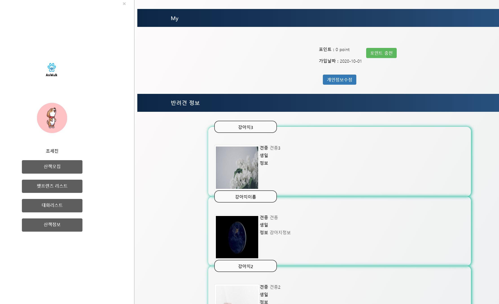
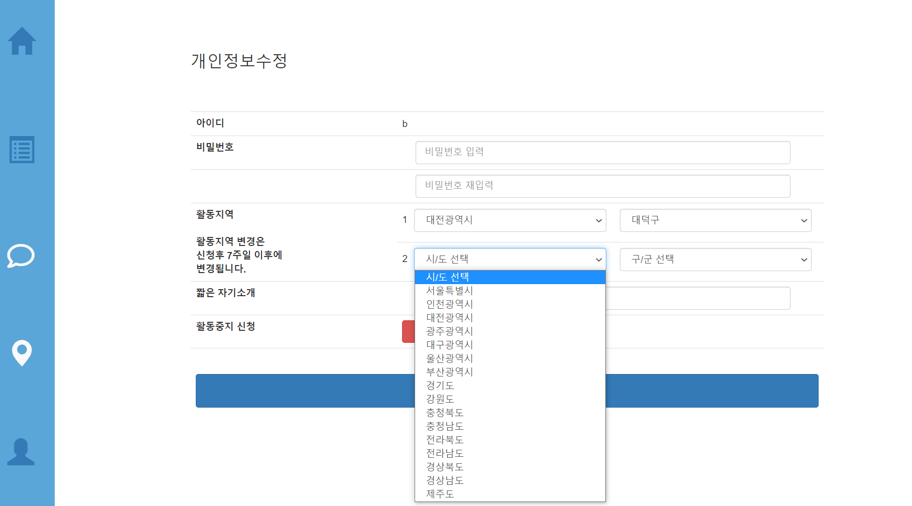

## 10/2(금)  

### owner page

------------

#### 1. owner myPage

- 강아지 주인의 my page에서 자신의 정보와 자신의 반려견의 정보를 보여줌

  - 뷰페이지에서 날짜 format 설정

  ```jsp
  <fmt:formatDate value="${joinDtos.get(0).getMem_join_date()}" pattern="yyyy-MM-dd"/>
  ```

  

- (미완성) 산책 내역





###### <ownerMy.jsp> : 뷰

- list를 담고있는 joinDtos에서 하나의 로우의 정보만 추출

  ```jsp
  <span>${joinDtos.get(0).getMem_point()} point</span>
  ```

```jsp
<%@ page language="java" contentType="text/html; charset=UTF-8"
    pageEncoding="UTF-8"%>
<%@ taglib prefix="c" uri="http://java.sun.com/jsp/jstl/core" %>
<%@ taglib prefix="fmt" uri="http://java.sun.com/jsp/jstl/fmt" %>
<!DOCTYPE html>
<html>
<head>
<meta charset="UTF-8">
<title>Insert title here</title>
	<link rel="stylesheet" type="text/css" href="${pageContext.request.contextPath}/static/css/owner.css">
	<link rel="stylesheet" href="https://maxcdn.bootstrapcdn.com/bootstrap/3.3.2/css/bootstrap.min.css">
	<link href="https://cdnjs.cloudflare.com/ajax/libs/font-awesome/5.13.0/css/all.min.css" rel="stylesheet">
</head>
<body>
<div class="my-page">
	<section class="my-part">
		<div class="subtitle">
			<h4>My</h4>
		</div>
		<ul>
			<li>
				<label>포인트 : </label>
				<span>${joinDtos.get(0).getMem_point()} point</span>
				<button class="btn btn-success" type="button">포인트 충전</button>
			</li>
			<li>
				<label>가입날짜 : </label>
				<span><fmt:formatDate value="${joinDtos.get(0).getMem_join_date()}" 									pattern="yyyy-MM-dd"/></span>
			</li>
		</ul>
		<button class="btn btn-primary" type="button">개인정보수정</button>
	</section>


	<section class="mydogs">
		<div class="subtitle">
			<h4>반려견 정보</h4>
		</div>
		
		<c:forEach items="${joinDtos}" var="joinDto">
		<div class="mydog-item">
			<div class="mydog-name">${joinDto.dog_name}</div>
			
			<ul>
				<li class="first">
					<label>견종</label>
					<span>${joinDto.dog_type}</span>
				</li>
				<li>
					<label>생일</label>
					<span>${joinDto.dog_birth}</span>
				</li>
				<li>
					<label>정보</label>
					<span class="text-area">
						${joinDto.dog_info}
					</span>
				</li>
			</ul>
		</div>
		</c:forEach>
		
		<div class="mydog-add">
			<i class="far fa-plus-square"></i>
			<label>반려견 추가</label>
		</div>
	</section>
```


###### <member.xml>

```xml
<select id="myPage" parameterType="String" resultType="joinMemberDogImage">
    select * from ani_dog d 
    left outer join ani_member m
    on d.mem_id = m.mem_id
    left outer join ani_dog_img i
    on i.dog_id = d.dog_id
    where mem_nickname=#{mem_nickname}
</select>
```


###### <MemberController.java>

```java
@RequestMapping("/owner/my.do")
public ModelAndView ownerMy(HttpServletRequest req) {
    ModelAndView mav = new ModelAndView();
    String mem_nickname = (String) req.getSession().getAttribute("mem_nickname");

    List<JoinMemberDogImgDTO> joinDtos = memverService.myPage(mem_nickname);

    mav.addObject("joinDtos", joinDtos);
    mav.setViewName("owner/my");
    return mav;
}
```


--------------

### walker page

----------

#### 2. walker myInfo page

- 세션에 저장되어 있는 walker의 아이디를 이용하여 정보가 들어있는 ANI_WALKER 테이블의 dto를 가져옴


###### <WalkerDAOImpl.java>

```java
//개인정보 불러오기
@Override
public WalkerDTO myInfo(String walker_id) {
    return session.selectOne("kr.pandorabox.aniwalk.walker.myInfo",walker_id);
}
```


###### <WalkerServiceImpl.java>

```java
@Override
public WalkerDTO myInfo(String walker_id) {
    return walkerDao.myInfo(walker_id);
}
```


###### <walker.xml>

```xml
<select id="myInfo" parameterType="String" resultType="walker">
    select * from ani_walker where walker_id = #{walker_id}
</select>
```


###### <WalkerController.java>

```java
//개인정보 수정하기
@RequestMapping("/walker/myInfo.do")
public ModelAndView myInfoUpdate(HttpServletRequest req) {
    ModelAndView mav = new ModelAndView();
    String walker_id = (String) req.getSession().getAttribute("walker_id");
    WalkerDTO walkerDto = walkerService.myInfo(walker_id);
    mav.addObject("walkerDto", walkerDto);
    mav.setViewName("walker/myInfo");
    return mav;
}
```


- 개인정보 수정 페이지에서 jquery를 사용한 활동지역 선택
  - select box를 이용하여 구현
- (수정필요) 활동 지역을 2곳을 선택할 수 있는지 팀원들과 회의가 필요





###### <walkerMyInfoUpdate.jsp> : 뷰페이지

```jsp
<div class="myinfo-update">

    <form action="/aniwalk/walker/myInfoModify.do">
        <h3>개인정보수정</h3>
        <table class="table">
            <tr>
                <th>아이디</th>
                <td>${walkerDto.walker_id}</td>
            </tr>
            <tr>
                <th>비밀번호</th>
                <td>
                    <input type="password" class="form-control" placeholder="비밀번호 입력">
                    <span class="text-primary"></span>
                    <span class="text-danger"></span>
                </td>
            </tr>
            <tr>
                <th></th>
                <td>
                    <input type="password" class="form-control" placeholder="비밀번호 재입력">
                    <span class="text-primary"></span>
                    <span class="text-danger"></span>
                </td>
            </tr>
            <tr>
                <th rowspan="2">
                    활동지역
                    <br><br>
                    활동지역 변경은<br>
                    신청후 7주일 이후에<br>
                    변경됩니다.
                </th>
                <td class="select-city">1
                    <select class="form-control" name="sido1" id="sido1">
                    </select>
                    <select class="form-control" name="gugun1" id="gugun1">
                    </select>
                </td>
            </tr>
            <tr>
                <td class="select-city">2
                    <select class="form-control" name="sido2" id="sido2">
                    </select>
                    <select class="form-control" name="gugun2" id="gugun2">
                    </select>
                </td>
            </tr>
            <tr>
                <th>짧은 자기소개</th>
                <td>
                    <input type="text" class="form-control">
                </td>
            </tr>
            <tr>
                <th>활동중지 신청</th>
                <c:choose>
                    <c:when test="${walkerDto.activity_state eq 1}">
                        <td>
                            <button type="button" class="btn btn-danger">활동중지</button>
                        </td>
                    </c:when>
                    <c:otherwise>
                        <td>
                            <button type="button" class="btn btn-danger">활동시작</button>
                        </td>
                    </c:otherwise>
                </c:choose>
            </tr>
            <tr>
                <th colspan="2">
                    <button type="submit" class="btn btn-primary">수정완료</button>
                </th>
            </tr>

        </table>
    </form>

</div>
```


###### <walkerMyInfoUpdate.jsp> : jquery

```jsp
<script>
 $('document').ready(function() {
	 var area0 = ["시/도 선택","서울특별시","인천광역시","대전광역시","광주광역시","대구광역시","울산광역시","부산광역시","경기도","강원도","충청북도","충청남도","전라북도","전라남도","경상북도","경상남도","제주도"];
	  var area1 = ["강남구","강동구","강북구","강서구","관악구","광진구","구로구","금천구","노원구","도봉구","동대문구","동작구","마포구","서대문구","서초구","성동구","성북구","송파구","양천구","영등포구","용산구","은평구","종로구","중구","중랑구"];
	   var area2 = ["계양구","남구","남동구","동구","부평구","서구","연수구","중구","강화군","옹진군"];
	   var area3 = ["대덕구","동구","서구","유성구","중구"];
	   var area4 = ["광산구","남구","동구",     "북구","서구"];
	   var area5 = ["남구","달서구","동구","북구","서구","수성구","중구","달성군"];
	   var area6 = ["남구","동구","북구","중구","울주군"];
	   var area7 = ["강서구","금정구","남구","동구","동래구","부산진구","북구","사상구","사하구","서구","수영구","연제구","영도구","중구","해운대구","기장군"];
	   var area8 = ["고양시","과천시","광명시","광주시","구리시","군포시","김포시","남양주시","동두천시","부천시","성남시","수원시","시흥시","안산시","안성시","안양시","양주시","오산시","용인시","의왕시","의정부시","이천시","파주시","평택시","포천시","하남시","화성시","가평군","양평군","여주군","연천군"];
	   var area9 = ["강릉시","동해시","삼척시","속초시","원주시","춘천시","태백시","고성군","양구군","양양군","영월군","인제군","정선군","철원군","평창군","홍천군","화천군","횡성군"];
	   var area10 = ["제천시","청주시","충주시","괴산군","단양군","보은군","영동군","옥천군","음성군","증평군","진천군","청원군"];
	   var area11 = ["계룡시","공주시","논산시","보령시","서산시","아산시","천안시","금산군","당진군","부여군","서천군","연기군","예산군","청양군","태안군","홍성군"];
	   var area12 = ["군산시","김제시","남원시","익산시","전주시","정읍시","고창군","무주군","부안군","순창군","완주군","임실군","장수군","진안군"];
	   var area13 = ["광양시","나주시","목포시","순천시","여수시","강진군","고흥군","곡성군","구례군","담양군","무안군","보성군","신안군","영광군","영암군","완도군","장성군","장흥군","진도군","함평군","해남군","화순군"];
	   var area14 = ["경산시","경주시","구미시","김천시","문경시","상주시","안동시","영주시","영천시","포항시","고령군","군위군","봉화군","성주군","영덕군","영양군","예천군","울릉군","울진군","의성군","청도군","청송군","칠곡군"];
	   var area15 = ["거제시","김해시","마산시","밀양시","사천시","양산시","진주시","진해시","창원시","통영시","거창군","고성군","남해군","산청군","의령군","창녕군","하동군","함안군","함양군","합천군"];
	   var area16 = ["서귀포시","제주시","남제주군","북제주군"];

	 

	 // 시/도 선택 박스 초기화

	 $("select[name^=sido]").each(function() {
	  $selsido = $(this);
	  $.each(eval(area0), function() {
	   $selsido.append("<option value='"+this+"'>"+this+"</option>");
	  });
	  $selsido.next().append("<option value=''>구/군 선택</option>");
	 });

	 

	 // 시/도 선택시 구/군 설정

	 $("select[name^=sido]").change(function() {
	  var area = "area"+$("option",$(this)).index($("option:selected",$(this))); // 선택지역의 구군 Array
	  var $gugun = $(this).next(); // 선택영역 군구 객체
	  $("option",$gugun).remove(); // 구군 초기화

	  if(area == "area0")
	   $gugun.append("<option value=''>구/군 선택</option>");
	  else {
	   $.each(eval(area), function() {
	    $gugun.append("<option value='"+this+"'>"+this+"</option>");
	   });
	  }
	 });


	});
</script>
```

