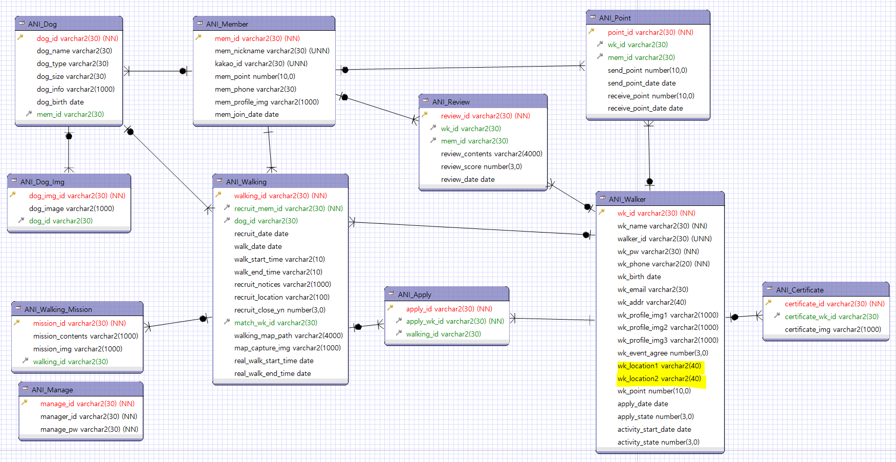
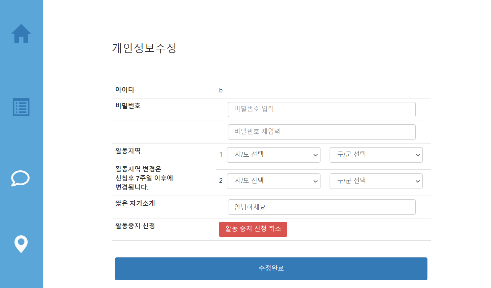

## 10/5(월)  

### walker page

------------

#### 1. walker myPage

- 개인정보 수정 페이지의 활동지역 선택이 2개이므로 location 컬럼 하나 추가

  - ERD

  


- walker가 활동을 잠시 중지하거나 다시 활동을 위한 버튼을 클릭하면 jquery로 버튼의 value값이 변경

  ```javascript
  var act = "${walkerDto.activity_state}"; //활동 중:1 , 활동 중지:2
  $(function(){
  	$('#act_btn').click(function(){
  		console.log(act);
  		if(act == 1){//상태가 활동 중인 경우
  			act = 2; //비활동으로 변경
  			document.getElementById('activity_state').value = act;
  			$(this).html('활동 중지 신청');
  		}else if(act ==2){//활동 중지인 경우 
  			act = 1; //활동으로 변경
  			document.getElementById('activity_state').value = act;
  			$(this).html('활동 중지 신청 취소');
  		}
  	});
  });
  ```

- 신청 시 적었던 자기소개 내용이 text box에 보이도록 구현
- (미완성)  원래 선택했던 활동지역이 select box에 보이도록 구현해야함


###### <WalkerController.java>

```java
//개인정보 수정하기
@RequestMapping("/walker/myInfo.do")
public ModelAndView myInfoUpdate(HttpServletRequest req) {
    ModelAndView mav = new ModelAndView();
    String walker_id = (String) req.getSession().getAttribute("walker_id");
    WalkerDTO walkerDto = walkerService.myInfo(walker_id);
    mav.addObject("walkerDto", walkerDto);
    mav.setViewName("walker/myInfo");
    return mav;
}

//개인정보 수정완료

@RequestMapping("/walker/myInfoModify.do")
public String myInfoModify(WalkerDTO walker,String sido2,String gugun2,String sido1,String gugun1) {
    System.out.println("시군구"+sido2+gugun2);
    String wk_location1 = sido1 + " " + gugun1;
    String wk_location2 = sido2 + " " + gugun2;
    walker.setWk_location1(wk_location1);
    walker.setWk_location2(wk_location2);
    walkerService.myInfoUpdate(walker);

    return "redirect:/walker/my.do";
}
```


###### <walkerMyInfoUpdate.java>

```jsp
<div class="myinfo-update">

    <form action="/aniwalk/walker/myInfoModify.do">
        <input type="hidden" name="walker_id" value="${walkerDto.walker_id}">
        <input type="hidden" name="activity_state" id="activity_state" value="${walkerDto.activity_state}">
        <h3>개인정보수정</h3>
        <table class="table">
            <tr>
                <th>아이디</th>
                <td>${walkerDto.walker_id}</td>
            </tr>
            <tr>
                <th>비밀번호</th>
                <td>
                    <input type="password" class="form-control" placeholder="비밀번호 입력" name="wk_pw">
                    <span class="text-primary"></span>
                    <span class="text-danger"></span>
                </td>
            </tr>
            <tr>
                <th></th>
                <td>
                    <input type="password" class="form-control" placeholder="비밀번호 재입력">
                    <span class="text-primary"></span>
                    <span class="text-danger"></span>
                </td>
            </tr>
            <tr>
                <th rowspan="2">
                    활동지역
                    <br><br>
                    활동지역 변경은<br>
                    신청후 7주일 이후에<br>
                    변경됩니다.
                </th>
                <td class="select-city">1
                    <select class="form-control" name="sido1" id="sido1" >
                    </select>
                    <select class="form-control" name="gugun1" id="gugun1">
                    </select>
                </td>
            </tr>
            <tr>
                <td class="select-city">2
                    <select class="form-control" name="sido2" id="sido2">
                    </select>
                    <select class="form-control" name="gugun2" id="gugun2">
                    </select>
                </td>
            </tr>
            <tr>
                <th>짧은 자기소개</th>
                <td>
                    <input type="text" class="form-control" name="wk_intro" value="${walkerDto.wk_intro}">
                </td>
            </tr>
            <tr>
                <th>활동중지 신청</th>
                <c:choose>
                    <c:when test="${walkerDto.activity_state eq 1}">
                        <td>
                            <button type="button" id="act_btn" class="btn btn-danger" >활동 중지 신청</button>
                        </td>
                    </c:when>
                    <c:otherwise>
                        <td>
                            <button type="button" id="act_btn" class="btn btn-danger" >활동 중지 신청 취소</button>
                        </td>
                    </c:otherwise>
                </c:choose>
            </tr>
            <tr>
                <th colspan="2">
                    <button type="submit" class="btn btn-primary">수정완료</button>
                </th>
            </tr>

        </table>
    </form>

</div>
```


###### <walker.xml>

```xml
<update id="myInfoUpdate" parameterType="walker">
    update ani_walker set wk_pw=#{wk_pw}, wk_location1=#{wk_location1}, wk_location2=#		{wk_location2}, wk_intro=#{wk_intro}, activity_state=#{activity_state} where 			walker_id=#{walker_id}
</update>
```




