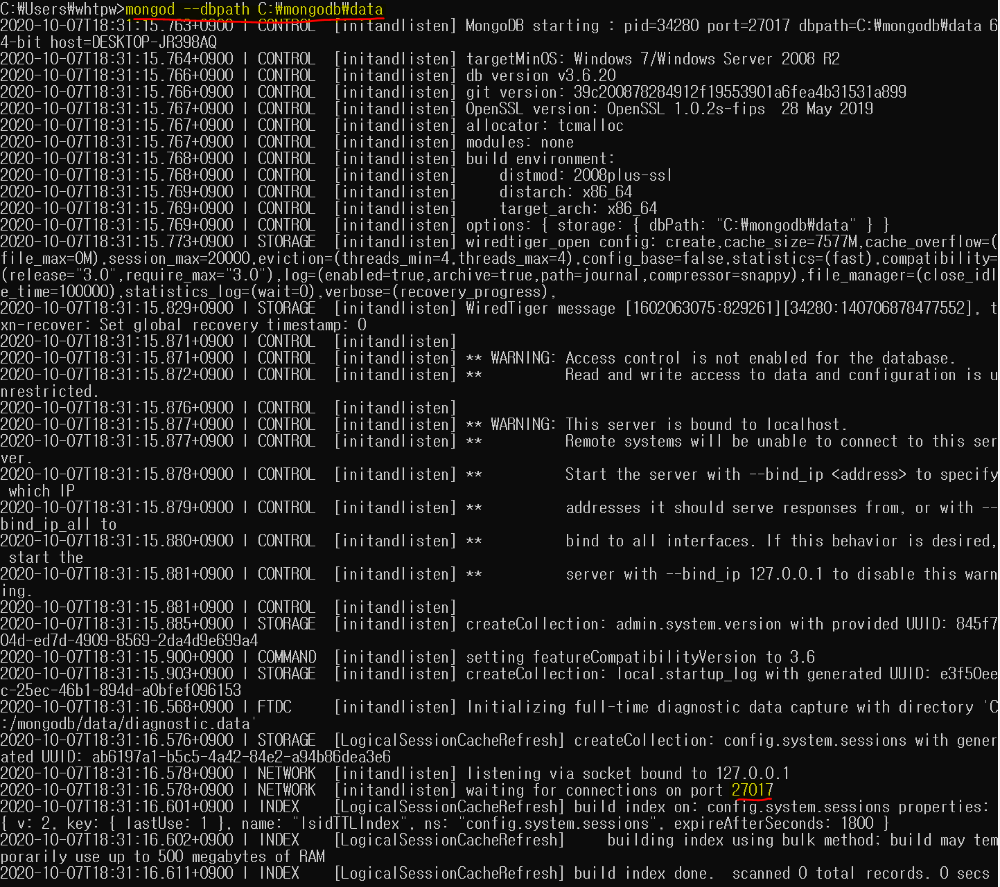

## 10/6(화)  

### mongodb

------------

#### 1. mongodb 설치

- https://www.mongodb.com/try/download/community 사이트에 접속
  - version : 3.6.20
  - platform : windows
  - package : msi

- setup 창 open - next

- agreement - next 

- setup type
  - Complete : 기본경로 C:Program Files 밑에 설치 
  - Custom : 설치 경로 설정

- next

- install

#### 2. 환경설정

- 환경변수 추가 

  - [내컴퓨터] 우클릭 -> [고급시스템설정] -> [환경변수(N)]
  - 시스템변수 리스트 중에서 PATH 편집(bin이 있는 위치로)

  

  - 에러 발생

  

  - (원인) Data directory 인 C:\data\db\ 폴더가 없음
  - (해결) 데이터가 들어갈 폴더가 존재하지 않아 C:\mongodb 에 data폴더를 생성한 후 경로를 C:\mongodb\data로 지정
    - mongod --dbpath C:\mongodb\data 입력
    - **wating for connections on port 27017 라고 출력되면** 정상적으로 실행 완료

  

- localhost:27017를 입력하여 'It looks like you are trying to access MongoDB over HTTP on the native driver port.'의 메시지가 출력되면 설치 완료

- MongoDB 연결

  - 기존의 cmd창을 닫지 않고 다른 cmd창을 열어서 mongo를 입력
  - db를 입력하면 어떤 데이터베이스도 생성되지 않은 경우 test가 출력이 되면 MongoDB 연결 성공

  

  

- pom.xml

- spring-config.xml

