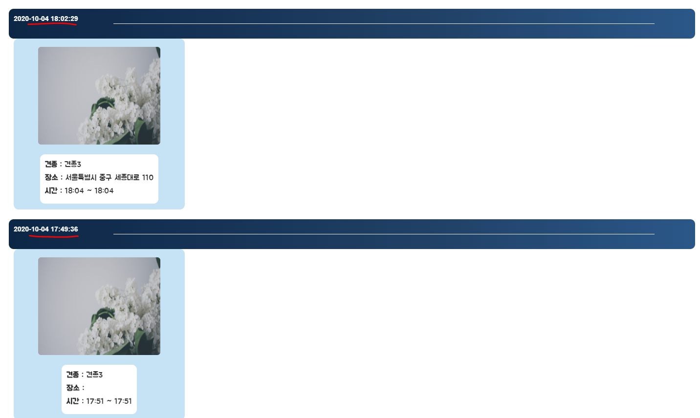
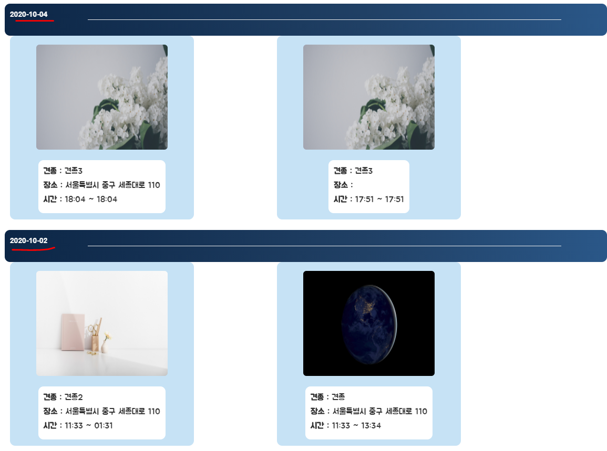

## 10/7(수)  

### owner

------------

#### 1. owner recruit Page

- 반려견의 주인이 올렸던 모집글 띄우기
  - 올린 날짜 별로 정렬
  - foreach의 요소를 활용하여 mystatus.index==0인 경우는 무조건 화면에 출력하고 그 뒤의 index들은 전의 index에 해당하는 날짜를 비교하여 같은 날짜인 경우 모집글을 같은 라인에 띄움
- (문제) 날짜가 시분초까지 인식하여 모두 다른 라인에 생성




###### <recruitList.java>

```java
	<div class="recruit-list">
		<div class="list-part">
		
			<!-- 날짜별 모집글 리스트 -->
			<c:forEach var="walkingDto" items="${walkingDtos}" varStatus="mystatus">
				<c:choose>
				
					<c:when test="${mystatus.index==0} "> <!-- 맨 처음인 경우 -->
						<div class="subtitle">
						<label>${walkingDto.recruit_date} </label>
						<hr width="80%" color="gray"/>
						</div>
						<div class="list-group" >
							<div class="list-item">
								
								<ul>
									<li>
										<label>견종 : </label>
										<span>${walkingDto.dog_type}</span>
									</li>
									<li>
										<label>장소 : </label>
										<span>${walkingDto.recruit_location}</span>
									</li>
									<li>
										<label>시간 : </label>
										<span>${walkingDto.walk_start_time} ~ ${walkingDto.walk_end_time}</span>
									</li>
								</ul>
							</div>
						</div>
					</c:when>
					<c:otherwise>	<!-- 맨 처음이 아닌 경우 -->
						<c:choose>
							<c:when test="${walkingDtos[mystatus.index-1].recruit_date==walkingDtos[mystatus.index].recruit_date}"> <!-- 위에 날짜와 같은 경우 -->
								<div class="list-group" >
								<div class="list-item">
									
									<ul>
										<li>
											<label>견종 : </label>
											<span>${walkingDto.dog_type}</span>
										</li>
										<li>
											<label>장소 : </label>
											<span>${walkingDto.recruit_location}</span>
										</li>
										<li>
											<label>시간 : </label>
											<span>${walkingDto.walk_start_time} ~ ${walkingDto.walk_end_time}</span>
										</li>
									</ul>
								</div>
								</div>
							</c:when>
						
							<c:otherwise>	<!-- 위의 날짜와 다른 경우 -->
								
								<div class="subtitle">
									<label>${walkingDto.recruit_date}</label>
									<hr width="80%" color="gray"/>
								</div>
								<div class="list-group">
									<div class="list-item">
										
										<ul>
											<li>
												<label>견종 : </label>
												<span>${walkingDto.dog_type}</span>
											</li>
											<li>
												<label>장소 : </label>
												<span>${walkingDto.recruit_location}</span>
											</li>
											<li>
												<label>시간 : </label>
												<span>${walkingDto.walk_start_time} ~ ${walkingDto.walk_end_time}</span>
											</li>
										</ul>
									</div>
								</div>
								
							</c:otherwise>
						</c:choose>
					</c:otherwise>
				</c:choose>
			</c:forEach>

		</div>

		<div class="btn-part">
			<button class="btn btn-default" type="button" onclick="location.href='/aniwalk/owner/recruit.do'">모집글 작성하기</button>
		</div>

	</div>
```


- (문제 해결) 쿼리문을 수정하여 recruit_date를 시분초를 제외한 날짜만 나오도록 수정

```xml
<!-- 자신이 올린 모집글 리스트-->
<select id="recruitlist" parameterType="String" resultType="walking">
	select to_char(w.recruit_date,'YYYY-MM-DD') as                					recruit_date,d.dog_type,w.recruit_location,
    w.walk_start_time, w.walk_end_time, i.dog_image
    from ani_walking w left outer join ani_dog d
	on w.dog_id=d.dog_id
	left outer join ani_dog_img i
	on i.dog_id=d.dog_id     
    left outer join ani_member m
    on m.mem_id=w.recruit_mem_id
    where m.mem_nickname=#{mem_nickname} 
    order by recruit_date desc 
		
	</select>
```

