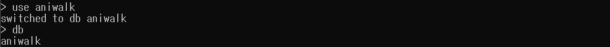
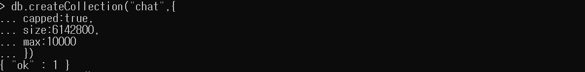
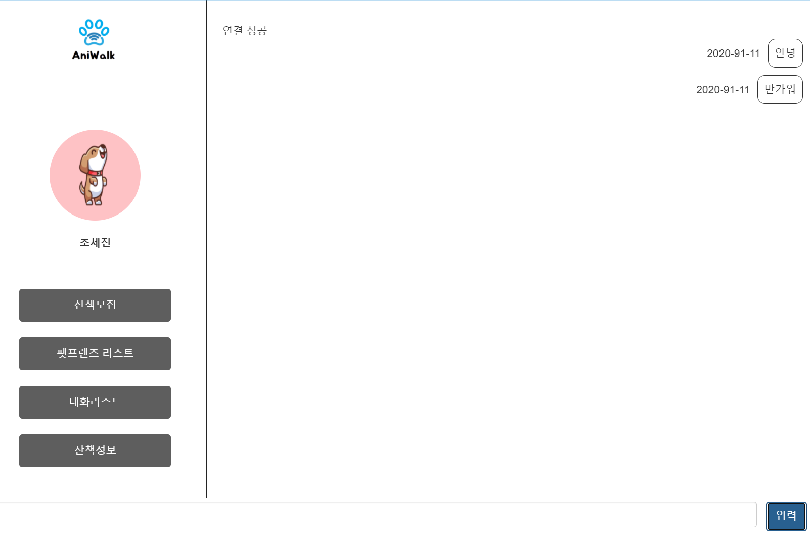
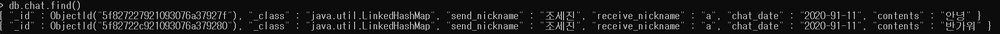

## 10/8(목)  

### owner

------------

#### 1. chat page

- owner chat page에서 웹소켓을 이용하여 채팅 구현
  - (오류) 현재 날짜 출력에서 월(month)이 제대로 나오지 않음

###### <pom.xml>

```xml
<!-- spring-websocket -->
<dependency>
    <groupId>org.springframework</groupId>
    <artifactId>spring-websocket</artifactId>
    <version>4.2.4.RELEASE</version>
</dependency>
<dependency> 
	<groupId>javax.websocket</groupId> 
	<artifactId>javax.websocket-api</artifactId> 
	<version>1.1</version> 
</dependency>
```


###### <BroadSocket.java>

```java
package kr.pandorabox.aniwalk.member;

import java.io.IOException;
import java.util.Collections;
import java.util.HashSet;
import java.util.Set;
 
import javax.websocket.OnClose;
import javax.websocket.OnMessage;
import javax.websocket.OnOpen;
import javax.websocket.Session;
import javax.websocket.server.ServerEndpoint;


@ServerEndpoint("/broadcasting")
public class BroadSocket {
    private static Set<Session> clients = Collections.synchronizedSet(new HashSet<Session>());
    
    @OnMessage
    public void onMessage(String message, Session session) throws IOException {
        System.out.println("111"+message);
        synchronized(clients) {
            for(Session client : clients) {
                if(!client.equals(session)) {
                    client.getBasicRemote().sendText(message);
                }
            }
        }
    }
    @OnOpen
    public void onOpen(Session session) {
        System.out.println(session);
        clients.add(session);
    }
    
    @OnClose
    public void onClose(Session session) {
        clients.remove(session);
    }
}
```


###### <ownerTalkContent.jsp>

```jsp

<script type="text/javascript">
//채팅
	//현재시간
	var Now = new Date();
	var NowTime = Now.getFullYear();
	NowTime += '-' + Now.getMonth() + 1 ;
	NowTime += '-' + Now.getDate();

    //var textarea = document.getElementById('messageWindow');
    var webSocket = new WebSocket("ws://localhost:8080/aniwalk/broadcasting");
    var inputMessage = document.getElementById('inputMessage');
    webSocket.onerror = function(event) {
        onError(event)
    };
    webSocket.onopen = function(event) {
        onOpen(event)
        console.log("open");
    };
    webSocket.onmessage = function(event) {
    	console.log("onmessage");
    	onMessage(event)
        
    };
    function onMessage(event) {
        var message = event.data.split("|");
        var sender = message[0];
        var content = message[1];
        console.log(sender + content);
        var chatToInsert ='';
        if (content == "") {
            
        } else {
        	if(sender == $("#chat_id").val()){ //내가 보낸 메시지
        		//나
            	chatToInsert += '<div class="my"><ul><li style="min-width: 60px"><span>'+NowTime+'</span></li>';
            	chatToInsert += '<li><div class="my-talk-content">'+content+'</div></li></ul></div>';
            	$("#messageWindow").append(chatToInsert)
        	}else{ //상대방
        		chatToInsert += '<div class="you">';
        		chatToInsert += '';
        		chatToInsert += '<ul><li><label>'+sender+'</label></li><li><div>'+content+'</div><span>'+NowTime+'</span></li></ul></div>';
        		$("#messageWindow").append(chatToInsert)	
        	}
        }
    }
    function onOpen(event) {
        $("#messageWindow").append("연결 성공");
    }
    function onError(event) {
        alert(event.data);
    }

   	$("#send").click(function(event){
   		console.log("onclick send()");
   		send();
   	})

    function send() {
        if (inputMessage.value == "") {
        } else {	//내가 메시지 보냈을 때
        	console.log('send()')
        	var chatToInsert ='';
        	chatToInsert += '<div class="my"><ul><li style="min-width: 60px"><span>'+NowTime+'</span></li>';
        	chatToInsert += '<li><div class="my-talk-content">'+inputMessage.value+'</div></li></ul></div>';
        	$("#messageWindow").append(chatToInsert) 
        }
        
        webSocket.send($("#chat_id").val() + "|" + inputMessage.value);
        inputMessage.value = "";

    }
    
    //     엔터키를 통해 send함
    function enterkey() {
        if (window.event.keyCode == 13) {
            send();
        }
    }
    //     채팅이 많아져 스크롤바가 넘어가더라도 자동적으로 스크롤바가 내려가게함
    window.setInterval(function() {
        var elem = document.getElementById('messageWindow');
        elem.scrollTop = elem.scrollHeight;
    }, 0);
    
</script>

```


-------------

### mongodb 

---------------

#### 2. spring과 mongodb 연동하기


- 의존성 추가 

###### <pom.xml>

```xml
<!-- mongodb -->
<dependency>
    <groupId>org.springframework.data</groupId>
    <artifactId>spring-data-mongodb</artifactId>
    <version>1.6.0.RELEASE</version>
</dependency>
<dependency>
    <groupId>org.mongodb</groupId>
    <artifactId>mongo-java-driver</artifactId>
    <version>2.13.2</version>
</dependency>
```


- 몽고디비 환경설정 

###### <mongo-config.xml>

```xml
<?xml version="1.0" encoding="UTF-8"?>
<beans xmlns="http://www.springframework.org/schema/beans"
	xmlns:xsi="http://www.w3.org/2001/XMLSchema-instance"
	xmlns:mongo="http://www.springframework.org/schema/data/mongo"
	xsi:schemaLocation="http://www.springframework.org/schema/beans http://www.springframework.org/schema/beans/spring-beans-4.0.xsd
		http://www.springframework.org/schema/data/mongo http://www.springframework.org/schema/data/mongo/spring-mongo-1.8.xsd">

   <!-- mongo -->
    <mongo:db-factory
    	id="mongoDbFactory"
    	host="localhost"
    	port="27017"
    	dbname="aniwalk"
        />
 
    <bean id="mongoTemplate" class="org.springframework.data.mongodb.core.MongoTemplate">
        <constructor-arg name="mongoDbFactory" ref="mongoDbFactory"/>
    </bean>	
		
</beans>
```


- mongo-config를 인식할 수 있도록 추가

###### <web.xml>

```xml
<param-value>
    /WEB-INF/config/spring-config.xml
    /WEB-INF/config/view-config.xml
    /WEB-INF/config/mongo-config.xml
</param-value>
```


-----------------------

#### 3. mongodb에 채팅 내용 insert

- mongodb db 생성
  - dbname : aniwalk




- mongodb collection 생성



```sql
db.createCollection("chat",{
	capped:true,
                    
                    })
```


###### <ownerTalkContent.jsp>

- send() 메소드에 ajax를 추가하여 insert할 data를 controller로 보냄

```jsp
<script>
	function send() {
        if (inputMessage.value == "") {
        } else {	//내가 메시지 보냈을 때
            console.log('send()')
            var chatToInsert ='';
            chatToInsert += '<div class="my"><ul><li style="min-width: 60px">					<span>'+NowTime+'</span></li>';
            chatToInsert += '<li><div class="my-talk-											content">'+inputMessage.value+'</div></li></ul></div>';
            $("#messageWindow").append(chatToInsert)

            var trans_object = {
                'send_nickname' : $("#chat_id").val(),
                'receive_nickname' : 'a',
                'chat_date' : NowTime,
                'contents' : inputMessage.value
            }
            var trans_json = JSON.stringify(trans_object); //json으로 변환

            $.ajax({
                url : "/aniwalk/owner/chatInsert.do",
                type: 'post',
                dataType : 'json',
                data : trans_json,
                contentType : 'application/json',
                momeType : 'application/json',
                success: function(retVal){
                    alert("success"+retVal.val);
                },
                error : function(retVal,status,er){
                    alert("error"+retVal);
                }
            });
		}
        webSocket.send($("#chat_id").val() + "|" + inputMessage.value);
        inputMessage.value = "";
    }
</script>
```


###### <ChatController.java>

```java
//mongodb에 insert
@RequestMapping(value="/owner/chatInsert.do", 
                method = RequestMethod.POST,
                produces = "application/json;charset=utf-8")
public @ResponseBody Map<String,Object> chatInsert(@RequestBody 																Map<String,Object> chat){
    Map<String,Object> retVal = new HashMap<String, Object>();

    System.out.println("contents : "+chat.get("contents"));
    System.out.println("chat_date : "+chat.get("chat_date"));
    System.out.println("send_nickname : "+chat.get("send_nickname"));
    
    service.chatInsert(chat);

    return retVal;
}
```


###### <ChatDAO, Impl>

```java
//ChatDAO.java
public void chatInsert(Map<String, Object> chat);

//ChatDAOImpl.java
@Autowired
MongoTemplate mongoTemplate;

@Override
public void chatInsert(Map<String, Object> chat) {
    mongoTemplate.insert(chat,"chat");
}
```


###### <ChatService, ServiceImpl.java>

```java
//ChatService.java
public void chatInsert(Map<String, Object> chat);

//ChatServiceImpl.java
@Autowired
ChatDAO dao;
@Override
public void chatInsert(Map<String, Object> chat) {
    dao.chatInsert(chat);
}
```


- 채팅 실행 화면




- db 저장 확인




-----------

#### 4. mongodb 내용 가져오기

- 채팅 내용을 가져와 처음 채팅 화면에 나올 수 있도록 구현
- collection에 넣는 내용 수정
  - onwerTalkContent.jsp : walker_id와 mem_nickname을 추가
  - ChatDAOImpl : Criteria API를 사용하여 조건에 맞는 데이터만 가져오기
- (미완성) walker_id를 받아오는 작업

###### <onwerTalkContent.jsp>

```javascript
var trans_object = {
'mem_nickname' : $("#chat_id").val(),
'walker_id' : 'a',
'send_nickname' : $("#chat_id").val(),
'receive_nickname' : 'a',
'chat_date' : NowTime,
'contents' : inputMessage.value
}
var trans_json = JSON.stringify(trans_object); //json으로 변환

$.ajax({ //mongodb insert
url : "/aniwalk/owner/chatInsert.do",
type: 'post',
dataType : 'json',
data : trans_json,
contentType : 'application/json',
momeType : 'application/json',
success: function(retVal){
alert("success"+retVal.val);
},
error : function(retVal,status,er){
alert("error"+retVal);
}
});
```


###### <ChatController.java> : 처음 화면을 띄울 때 전에 한 채팅 내역 가져오기

```java
//mongodb chat Find
@RequestMapping("/owner/talkContent.do")
public ModelAndView chatFind(HttpServletRequest req) {
    ModelAndView mav = new ModelAndView();

    String mem_nickname = (String) 																		req.getSession().getAttribute("mem_nickname");
    Map<String, Object> searchCondition = new HashMap<String, Object>();
    searchCondition.put("mem_nickname", mem_nickname);
    //walker_id도 추가하기
    searchCondition.put("walker_id", "a");
    System.out.println(searchCondition.get("walker_id") +"find walker_id");
    System.out.println(searchCondition.get("mem_nickname")+"find mem_nickname");

    //등록 서비스 호출
    List<ChatDTO> chatDtos = service.chatFind(searchCondition);
    System.out.println("size : "+chatDtos.size());
    mav.addObject("mem_nickname", mem_nickname);
    mav.addObject("chatDtos", chatDtos);
    mav.setViewName("owner/talkContent");
    return mav;
}
```


###### <view-config.xml>

```xml
<!-- 삭제 -->
<view-controller path="/owner/talkContent.do" view-name="owner/talkContent"/>
```


###### <ChatDAO, Impl>

```java
//ChatDAO.java
public List<ChatDTO> chatFind(Map<String, Object> searchCondition);

//ChatDAOImpl.java
@Autowired
MongoTemplate mongoTemplate;

@Override
public List<ChatDTO> chatFind(Map<String, Object> searchCondition) {
    Query query = new Query(new Criteria().andOperator(
        Criteria.where("mem_nickname").is(searchCondition.get("mem_nickname")),
        Criteria.where("walker_id").is(searchCondition.get("walker_id"))));
    List<ChatDTO> docs = mongoTemplate.find(query, ChatDTO.class,"chat");
    return docs;
}
```


###### <ChatService, ServiceImpl.java>

```java
//ChatService.java
public List<ChatDTO> chatFind(Map<String, Object> searchCondition);

//ChatServiceImpl.java
@Autowired
ChatDAO dao;
@Override
public List<ChatDTO> chatFind(Map<String, Object> searchCondition) {
    return dao.chatFind(searchCondition);
}
```


