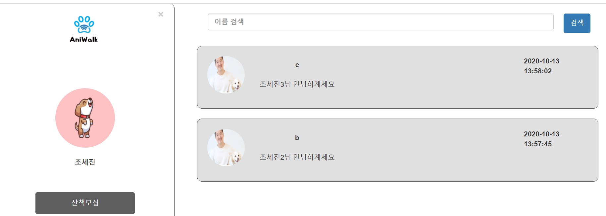

## 10/12(월)  

### owner

------------

#### 1. chat list 

- 내가 한 채팅 리스트 띄우기
  - mem_nickname이 세션에 저장되어 있는 mem_nickname과 같은 것과 walker_id, _id로 정렬한 뒤 채팅 내역을 mongodb에서 dto형식으로 가져온다.
  - dto로 가져온 것을 walker_id를 확인하여 다른 walker_id의 row가 나올 때마다 새롭게 생성한 list에 추가

###### <ChatController.java>

```java
//채팅리스트
//talkList
@RequestMapping("/owner/talk.do")
public ModelAndView chatList(HttpServletRequest req) {
    ModelAndView mav = new ModelAndView();
    String mem_nickname = (String) req.getSession().getAttribute("mem_nickname");
    Map<String, Object> chatList = new HashMap<String, Object>();
    chatList.put("mem_nickname", mem_nickname);
    List<ChatDTO> chatDtos = service.chatList(chatList);
    List<ChatDTO> chatLists = new ArrayList<ChatDTO>(); //새롭게 만드는 list
    int chatIndex = 0;
    for(int i=0;i<chatDtos.size();++i) {
        if(i==0) {
            chatLists.add(chatIndex, chatDtos.get(i)) ;
            chatIndex += 1;
        }else {
            if(! (chatDtos.get(i).getWalker_id()).equals((chatDtos.get(i-1).getWalker_id())) ) {//새롭게 만든 list에 담기
                chatLists.add(chatIndex, chatDtos.get(i)) ;
                chatIndex += 1;
            }
        }
    }
    System.out.println("size"+chatLists.size());
    mav.addObject("chatLists", chatLists);
    mav.setViewName("owner/talkList");
    return mav;
}
```


###### <ownerTalkerList.jsp>

```java
<%@ page language="java" contentType="text/html; charset=UTF-8"
    pageEncoding="UTF-8"%>
<%@ taglib prefix="c" uri="http://java.sun.com/jsp/jstl/core"%>
<!DOCTYPE html>
<html>
<head>
<meta charset="UTF-8">
<title>톡리스트</title>
	<link rel="stylesheet" type="text/css" href="${pageContext.request.contextPath}/static/css/owner.css">
	<link rel="stylesheet" href="https://maxcdn.bootstrapcdn.com/bootstrap/3.3.2/css/bootstrap.min.css">
	<link href="https://cdnjs.cloudflare.com/ajax/libs/font-awesome/5.13.0/css/all.min.css" rel="stylesheet">
</head>
<body>
	<div class="talk-list">
		<!-- 검색 -->
		<div class="search-part">
			<form name="walkerListSearchForm">
				<label>
					<input class="form-control" type="search" placeholder="이름 검색">
				</label>
				<button class="btn btn-primary" type="submit">검색</button>
			</form>
		</div>

		<div class="list-part" >
			<c:forEach var="chatList" items="${chatLists}">
				<div class="talk-item">
					<ul>
						<li>
							<a href="/aniwalk/owner/talkContent.do?walker_id=${chatList.walker_id}"></a>
						</li>
						<li>
							<div>
								<label>${chatList.walker_id }</label>
								<span>${chatList.contents}</span>
							</div>
						</li>
					</ul>
					<label>${chatList.chat_date}</label>
				</div>
			</c:forEach>
		</div>
	</div>
</body>
</html>
```


###### <ChatDAOImpl.java>

```java
	@Override
	public List<ChatDTO> chatList(Map<String, Object> chatList) {
		Query query = new Query(new Criteria().andOperator(
				Criteria.where("mem_nickname").is(chatList.get("mem_nickname"))
				));
		query.with(new Sort(Sort.Direction.DESC,"walker_id")
				.and(new Sort(Sort.Direction.DESC,"_id")));
		List<ChatDTO> docs = mongoTemplate.find(query, ChatDTO.class,"chat");
		return docs;
	}
```


- 최종 채팅 구현

