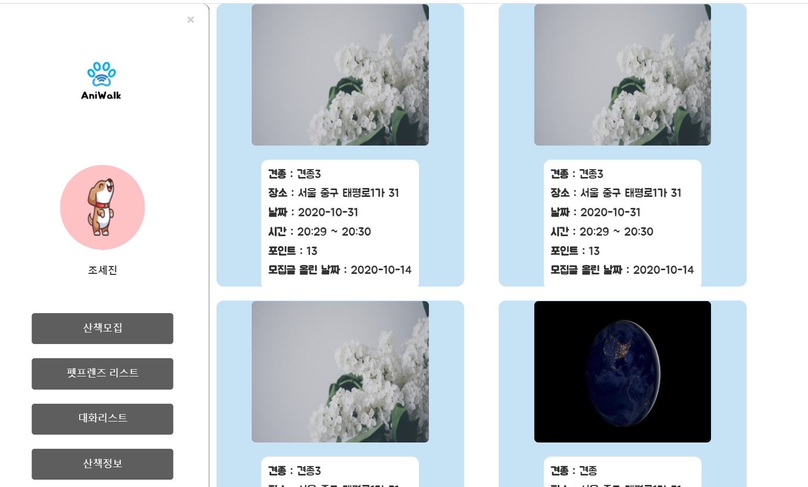
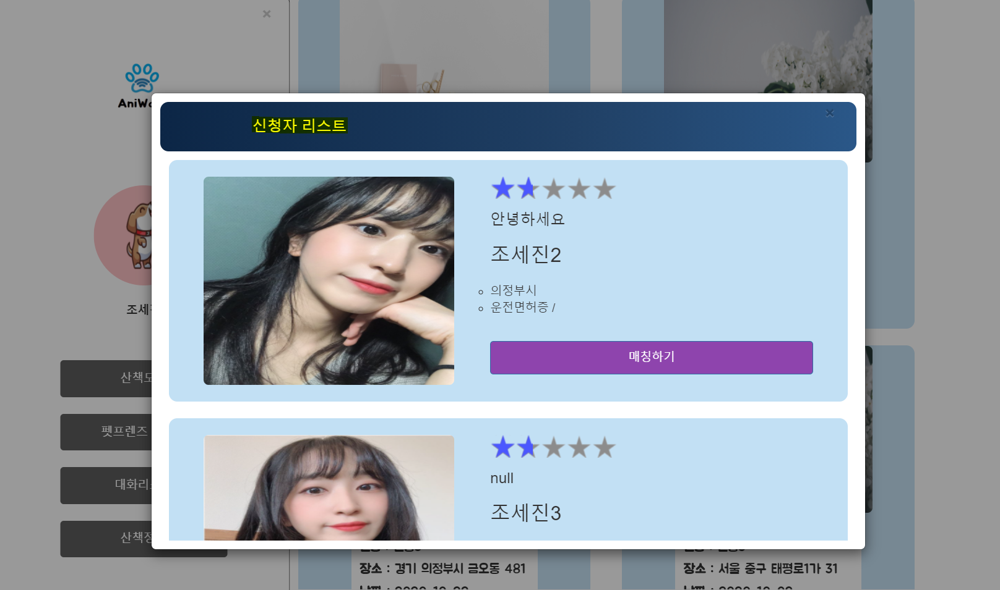

## 10/13(화)  

### owner

------------

#### 1. 내가 올린 모집 공고 리스트 수정

- 내가 올린 모집 공고 날짜별로 띄우지 않게 수정 
- 공고 올린 시간이 아닌 산책 시간, 날짜가 보이게 수정
- 산책 수행 시 얻을 수 있는 포인트 보이게 수정
  - 올린 포인트만큼 나의 포인트 차감(member 테이블 point 업데이트)


###### <ownerRecruitList.jsp>

```jsp
<div class="list-part">
    <!-- 날짜별 모집글 리스트 -->
    <c:forEach var="walkingDto" items="${walkingDtos}" >

        <div class="list-group" >
            <div class="list-item">
                
                <ul>
                    <li>
                        <label>견종 : </label>
                        <span>${walkingDto.dog_type}</span>
                    </li>
                    <li>
                        <label>장소 : </label>
                        <span>${walkingDto.recruit_location}</span>
                    </li>
                    <li>
                        <label>날짜 : </label>
                        <span>${walkingDto.walk_date.replace('00:00:00','')}</span>
                    </li>
                    <li>
                        <label>시간 : </label>
                        <span>${walkingDto.walk_start_time} ~ ${walkingDto.walk_end_time}</span>
                    </li>
                    <li>
                        <label>포인트 : </label>
                        <span>${walkingDto.walking_point}</span>
                    </li>
                    <li>
                        <label>모집글 올린 날짜 : </label>
                        <span>${walkingDto.recruit_date}</span>
                    </li>
                </ul>
            </div>
        </div>
    </c:forEach>
</div>
```


###### <walking.xml>

```xml
<!-- 모집글 올리면 포인트 업데이트(member db) -->
<update id="recruitUpdate" parameterType="walking">
    <![CDATA[
  update ani_member set mem_point=mem_point-#{walking_point} where mem_id=#{recruit_mem_id}
  ]]>
</update>

<!-- 자신이 올린 모집글 리스트-->
<select id="recruitlist" parameterType="String" resultType="walking">
    select to_char(w.recruit_date,'YYYY-MM-DD') as recruit_date,d.dog_type,w.recruit_location,
    w.walk_start_time, w.walk_end_time, i.dog_image, w.walk_date, w.walking_point
    from ani_walking w left outer join ani_dog d
    on w.dog_id=d.dog_id
    left outer join ani_dog_img i
    on i.dog_id=d.dog_id
    left outer join ani_member m
    on m.mem_id=w.recruit_mem_id
    where m.mem_nickname=#{mem_nickname} 
    order by w.recruit_date desc 
</select>
```


###### <WalkingController.java>

```java
//포인트 update 추가
walkingService.recruitUpdate(walking);

//return하는 페이지 변경
return "redirect:/owner/recruitList.do"
```


- 결과




---------------

#### 2. 내가 올린 모집글에 신청한 walker 중 매칭

- 내가 올린 모집글 하나를 클릭하면 그 모집글에 애완동물 산책을 신청한 walker의 정보가 모달창에 나온다. (모집글 리스트와 같은 뷰에서 처리)
-  모달창을 script에서 띄우도록 설정하므로 ajax를 이용하여 walker의 정보를 불러온다.
  - for문이 돌면서 모달창이 하나 생길 때마다 ajax로 값(list로 된 신청한 모든 walker의 정보)을 받아옴
  - 성공적으로 값을 받아오면 for문을 이용하여 신청한 워커들의 정보를 띄운다.
- (에러) 신청한 walker의 리스트를 가져올 때 앞에서 선택한 walker가 누적되어 모달창에 띄어진다.
- (에러) 또한, walking_id값이 맨 마지막의 row의 walking_id로 선택 된다.

###### <ownerRecruitList.jsp>

```jsp
<script>
	//모달창
	const listItems = document.querySelectorAll('.list-item');
	const modalBg = document.querySelector('.modal-bg');
	const close = document.querySelector('.close');

	const modalClose = function(){
		modalBg.classList.add('hidden');
	}

	for(let i=0; i<listItems.length; i++){
		listItems[i].addEventListener('click',function(){
			modalBg.classList.remove('hidden');
			//walking_index=i;
			var walking_id = $('#walking_id').val();
			console.log("test==>"+walking_id);
			
			$.ajax({
				url: "/aniwalk/walking/ajax_applyList.do" ,
				type: "get",
				data:  {
							"walking_id" : walking_id
						},
				success: function(data){ //익명으로 함수 생성
					var add='';
					var move = "location.href='/aniwalk/walking/matching.do?match_wk_id=" ; 
					var end ="'";
					for (var i=0; i<data.length; i++){
						add += '<div class="list-item">' ; 
						add += '<div class="right-part"><ul><li><div><div class="star-rating"><span style="width:30%"></span>';
						add += '</div></div></li><li><h4>'+data[i].wk_intro+'</h4></li><li><h3>'+data[i].wk_name+'</h3></li>';
						add += '<li><ul><li class="addr">'+data[i].wk_addr+'</li><li>'+data[i].wk_certificate_list+'</li></ul></li>' ; 
						add += '<li><button class="btn btn-primary" type="button" onclick="'+move+data[i].apply_wk_id+'&walking_id='+walking_id+end+'">매칭하기</button></li></ul></div></div>';
					}
					
					$('#list').append(add);

				},
				error: function(a,b,c){ //ajax 실패시 원인
					alert("에러"+c);
				}
			})
			
		});
	}

	modalBg.addEventListener('click',modalClose);
	close.addEventListener('click',modalClose);
</script>
```


###### <WalkingController.java>

```java
//신청자 list
@RequestMapping(value="/walking/ajax_applyList.do",
                method = RequestMethod.GET,
                produces = "application/json;charset=utf-8")
public @ResponseBody List<ApplyWalkingDTO> ajax_applyList(String walking_id){
    List<ApplyWalkingDTO> applyList = walkingService.applyList(walking_id);
    System.out.println(applyList);
    return applyList;
}
```


###### <walking.xml>

```xml
<!-- 신청자 리스트 -->
<select id="applyList" parameterType="String" resultType="apply">
    select * from ani_apply a left outer join ani_walking w
    on a.walking_id = w.walking_id
    left outer join ani_walker m
    on m.wk_id = a.apply_wk_id
    where a.walking_id=#{walking_id}
</select>
```


- (에러 해결)
  - c:foreach를 사용하여 walker_id의 값을 가져온다.
  - append를 담은 add의 초기화 순서와 $('#list').empty()를 추가해준다.


###### <ownerRecruitList.jsp>

```java
<script>
    	//walking_id 받아오기
	var i = 0;
	var walkingList = new Array();
	<c:forEach items="${walkingDtos}" var="dto">
		walkingList[i] = "${dto.walking_id}";
		i+=1;
	</c:forEach>
	console.log("리스트====>"+walkingList[0]+walkingList[1]);
	
	for(let i=0; i<listItems.length; i++){
		
		listItems[i].addEventListener('click',function(){
			
			modalBg.classList.remove('hidden');
			console.log("i====>"+i);
			
			var walking_id = walkingList[i];
			console.log('여기여기여기'+walking_id);
			

			$.ajax({
				url: "/aniwalk/walking/ajax_applyList.do" ,
				type: "get",
				data:  {
							"walking_id" : walking_id
						},
				success: function(data){ //익명으로 함수 생성
					var add='';
					var move = "location.href='/aniwalk/walking/matching.do?match_wk_id=" ; 
					var end ="'";
					$('#list').empty();
					for (var i=0; i<data.length; i++){
						add += '<div class="list-item">' ; 
						add += '<div class="right-part"><ul><li><div><div class="star-rating"><span style="width:30%"></span>';
						add += '</div></div></li><li><h4>'+data[i].wk_intro+'</h4></li><li><h3>'+data[i].wk_name+'</h3></li>';
						add += '<li><ul><li class="addr">'+data[i].wk_addr+'</li><li>'+data[i].wk_certificate_list+'</li></ul></li>' ; 
						add += '<li><button class="btn btn-primary" type="button" onclick="'+move+data[i].apply_wk_id+'&walking_id='+walking_id+end+'">매칭하기</button></li></ul></div></div>';
					}
					$('#list').empty();
					$('#list').append(add);
					
		
				},
				error: function(a,b,c){ //ajax 실패시 원인
					alert("에러"+c);
				}
			})

		});
	}
</script>    
```





---------

#### 3. walker 매칭

- 모집글을 올린 owner가 여러 walker들 중에서 한 명의 walker를 선택하면 매칭이 됨
  - 매칭하기 버튼을 누르면 db에서 모집글의 상태가 모집 종료로 바뀌고 매칭 워커의 컬럼이 선택된 워커의 인덱스가 들어간다.

###### <walking.xml>

```xml
<!-- owner가 워커 선택(매칭)-->
<update id="matching" parameterType="Map">
    update ani_walking set match_wk_id=#{match_wk_id},recruit_close_yn=1 where walking_id=#{walking_id}
</update>
```


###### <WalkingController.java>

```java
//매칭 하기
@RequestMapping("/walking/matching.do")
public String matching(String match_wk_id, String walking_id) {
    //매칭
    Map<String, String> map = new HashMap<String, String>();
    map.put("match_wk_id", match_wk_id);
    map.put("walking_id", walking_id);
    walkingService.matching(map);
    return "owner/activityList";
}
```

